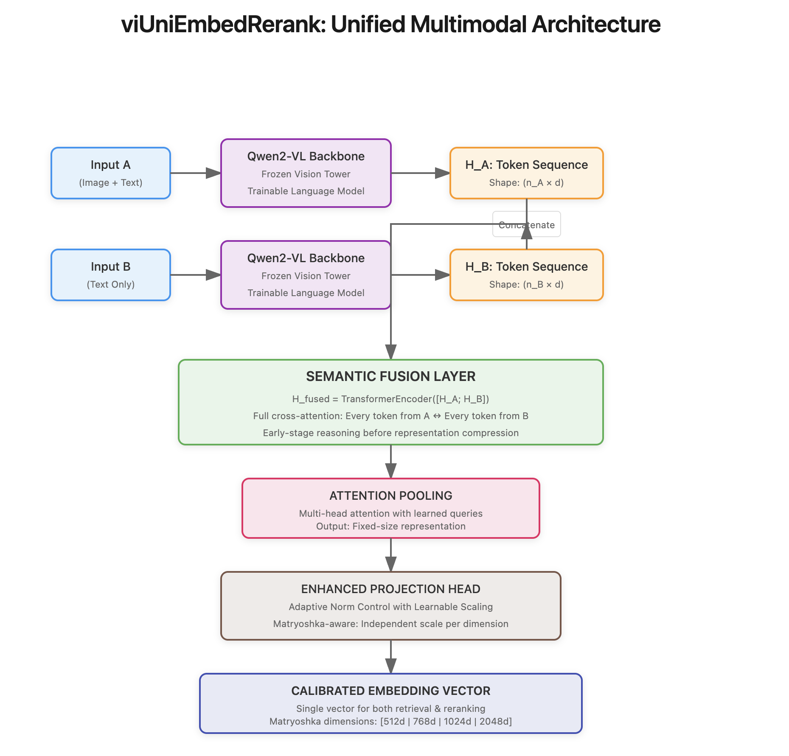

\begingroup
\setlength{\leftskip}{2em}
\setlength{\rightskip}{2em}
\noindent

### **Abstract**

We introduce viUniEmbedRerank, a novel architecture that collapses the conventional multi-stage search pipeline into a single, unified multimodal embedding model. Our core innovation, **Early-Stage Semantic Fusion**, directly confronts the inherent limitations of "late-stage reasoning" prevalent in dual-encoder models. By enforcing token-level, cross-modal interaction *before* representation pooling, viUniEmbedRerank learns a deeply contextualized embedding space, moving beyond superficial modality tagging to achieve true semantic comprehension. This is supported by a synergistic framework of four key contributions: (1) A **Tri-Bucket Loss System** that orthogonally applies specialized mathematical objectives to distinct data typologies, resolving catastrophic gradient conflicts; (2) **A Data-Driven Hierarchical Warmup Schedule** that prioritizes linguistic foundation building, informed by a novel **Balanced Intersection Point (BIP)** algorithm; (3) **Adaptive Norm Control**, a Matryoshka-aware mechanism with learnable scaling that dynamically manages the gradient-expressiveness trade-off; and (4) A **Defense-in-Depth Training Framework**, featuring a Proactive Filtering `GradientVaccine` and Component-Wise Gradient Clipping, to ensure robust convergence. Trained on a meticulously curated 8.7-million-sample "Five Pillars" dataset, viUniEmbedRerank produces a single, calibrated vector capable of both high-throughput retrieval and high-fidelity reranking, offering a paradigm shift towards efficient, unified, and truly intelligent multimodal search.

\endgroup

\vspace{1em}

---

### **1. Introduction: Deconstructing the Fragmented Search Paradigm**

The predominant paradigm for large-scale multimodal search is architecturally and computationally fragmented. Production systems are almost universally bifurcated into: 1) A **fast retrieval stage** employing bi-encoders for approximate search, and 2) A **slow reranking stage** using expensive cross-encoders for precision. This dichotomy creates cascading inefficiencies: doubled infrastructure costs, compounded latencies, and a high risk of irrecoverable relevance loss. Emerging multi-vector approaches like ColPali (Faysse et al., 2024) further exacerbate this issue by generating multiple embeddings per document, creating a fundamental impedance mismatch with standard, single-vector database indices.

We posit that this fragmentation stems from a deeper architectural flaw: **late-stage reasoning**. Existing models compress each modality into information-poor summary vectors *before* any comparison occurs. This premature compression irreversibly destroys the fine-grained, token-level relationships required for complex multimodal understanding. A model asked "What color is the car on the left?" fails because the concepts of "color," "car," and "left" were collapsed into a single vector before their relationship could be established.

viUniEmbedRerank is engineered from first principles to dismantle this flawed paradigm. Our architecture:
- Generates a **single, production-ready vector** per document, calibrated for both cosine-similarity retrieval and score-based reranking.
- Implements **early-stage reasoning**, forcing cross-modal token interaction *before* representational compression.
- Learns a **unified semantic manifold** where Euclidean distance and cosine similarity are imbued with calibrated, real-world relevance, enabling true **cross-modal (text-to-image and image-to-text) search**.

---

### **2. The viUniEmbedRerank Architecture: Reasoning Before Representation**

#### **2.1 The Semantic Fusion Breakthrough**

The architectural "original sin" of dual-encoders is the premature pooling that separates representation from reasoning. viUniEmbedRerank inverts this paradigm. We introduce a **Semantic Fusion Layer**—a standard `nn.TransformerEncoderLayer`—that operates on concatenated token sequences, architecturally compelling a state of **"symmetric cross-attention"** where reasoning precedes representation.

\vspace{1em}

\vspace{1em}

Mathematically, given token-level hidden states $\mathbf{H}_A \in \mathbb{R}^{n_A \times d}$ and $\mathbf{H}_B \in \mathbb{R}^{n_B \times d}$, our fusion mechanism is:
$$
\mathbf{H}_{fused} = \text{TransformerEncoder}([\mathbf{H}_A; \mathbf{H}_B], \mathbf{M}_{pad})
$$
The self-attention mechanism, $\text{Attention}(Q,K,V) = \text{softmax}(\frac{\mathbf{QK}^T}{\sqrt{d_k}})\mathbf{V}$, now operates on a combined key-value space where $K, V \in \mathbb{R}^{(n_A+n_B) \times d}$. This forces every token from $\mathbf{H}_A$ to compute an attention score with every token from $\mathbf{H}_B$, and vice-versa, creating a deeply contextualized, pre-reasoned state.

#### **2.2 Core Architectural Components**

- **Backbone**: Qwen2-VL-2B-Instruct. The vision tower is frozen; the language model components are fully trainable.
- **Fusion Layer**: A standard `nn.TransformerEncoderLayer` acting as the "reasoning chamber."
- **Attention Pooling (`MultiHeadAttentionPooling`):** A multi-head attention layer with a learnable query vector, $\mathbf{w}_{query} \in \mathbb{R}^{d}$, that learns to distill the most salient information from the fused sequence.
- **Enhanced Projection (`EnhancedEmbeddingProjection`):** A final two-layer MLP that produces the embedding, incorporating our Adaptive Norm Control system.

---

### **3. The Physics of the Embedding Space: A Duality of Forces**

A stable embedding space is a hard-won equilibrium between a **centripetal "pull" force** (attraction) and a **centrifugal "push" force** (repulsion). Our loss architecture is designed to precisely engineer this duality to prevent model cheating and representational collapse.

#### **3.1 The "Pull" Force: Forging Semantic Links for Search & Reranking**

- **Absolute Alignment (InfoNCE):** For **cross-modal search**, our `ocr_vqa_loss` uses InfoNCE as a powerful gravitational pull, crucial for forcing an image vector and its corresponding text vector to co-locate in the embedding space.
  $$
  \mathcal{L}_{\text{pull-strong}} = -\log\frac{\exp(\text{sim}(A_i, P_i)/\tau)}{\sum_j \exp(\text{sim}(A_i, N_j)/\tau)}
  $$
- **Calibrated Alignment (MSE):** For **reranking**, the `text_pair_loss` uses an MSE component to ensure the final distance precisely reflects the ground-truth score $s$.
  $$
  \mathcal{L}_{\text{pull-calibrated}} = ||\sigma(\text{sim}(A, P)) - s||^2_2 \quad \text{where} \quad \sigma(x) = (x+1)/2
  $$

#### **3.2 The "Push" Force: Preventing the Singularity (Collapse)**

- **Global Repulsion (The "Big Bang"):** Our `hard_negative_loss` acts as a universe-expanding force. By applying $\mathcal{L}_{\text{push-global}} = \mathbb{E}[1 + \text{cos}(\mathbf{e}_A, \mathbf{e}_B)]$ to cross-domain pairs, it carves out vast "semantic oceans" between unrelated concepts.
- **Targeted Defensive Repulsion (`zero-push`):** This is our most advanced mechanism, a "smart" push force that only activates to penalize mistakes.
  $$
  \mathcal{L}_{\text{push-defense}} = \lambda_{\text{push}} \cdot \mathbb{E}_{\text{neg}}[ (\text{ReLU}(\text{sim}(A_i, N_j)))^2 ]
  $$
  The `ReLU` ensures it only applies to negative pairs with erroneously high similarity. The quadratic term $(\cdot)^2$ creates an exponentially larger penalty for more severe mistakes, acting as an aggressive, non-linear "immune response" against the symptoms of collapse.

---

### **4. Defense-in-Depth: A Framework for Stable Multimodal Training**

Based on analysis of over 24 systematic failures, we engineered a multi-layered defensive framework.

#### **4.1 Proactive Filtering `GradientVaccine`**

Our `GradientVaccine` is a **proactive data filter**. Based on a logarithmic growth schedule, $p_{vision}(t) = \min(1.0, p_0 \cdot r^t)$, it stochastically determines if a batch can contain multimodal samples. With $p_0=0.02, r=1.0005$, the model is guaranteed a "text-first" curriculum, building a robust linguistic foundation before full multimodal integration occurs around step 7,800.

#### **4.2 Data-Driven Hierarchical Warmup (BIP Algorithm)**

We introduce a novel **Balanced Intersection Point (BIP)** algorithm to scientifically determine the warmup duration for text-specific loss weights ($\lambda_{\text{score}}, \lambda_{\text{rank}}, \lambda_{\text{push}}$) and temperature $\tau$. The `text_warmup_steps` ($\approx 4,413$) is calculated to complete just as the `GradientVaccine` allows the flow of multimodal data to reach its natural distribution ratio in the dataset ($\approx 39\%$). This is paired with a hierarchical learning rate structure that protects semantic anchors (`lr_embeddings = base_lr / 10.0`) while aggressively training new components (`lr_new_layers = base_lr * 3.0`).

#### **4.3 Adaptive Norm Control & Component-Wise Clipping**

We employ a two-pronged strategy to manage gradients:
1.  **Adaptive Norm Control:** This differentiable mechanism allows the model to learn the optimal embedding norm. The projection head outputs an embedding $\mathbf{e}'_d$ for each Matryoshka dimension $d$ via:
    $$
    \mathbf{e}'_d = \underbrace{\text{F.normalize}(\mathbf{e}_d)}_{\text{Direction Only}} \cdot \underbrace{\sigma(\mathbf{s}_d)}_{\text{Learnable Magnitude}}
    $$
    where $\mathbf{s}_d$ is a learnable `nn.Parameter` and $\sigma(x) = \text{clamp}(x, 5.0, 20.0)$ is a soft guardrail. This decouples the learning of direction and magnitude.
2.  **Component-Wise Gradient Clipping:** We apply different clipping thresholds to different parts of the model, acknowledging their varying stability. For instance, newly initialized layers like the `fusion_layer` and `embedding_head` receive a stricter clip value (e.g., 5.0) than the more stable, pretrained backbone layers (e.g., 1.0).

---

### **5. The Five Pillars Dataset Architecture**

Our 8.7M sample dataset enforces a **"zero contamination"** principle (no image is used across multiple task pillars) and is structured into five pillars to provide clean, non-conflicting learning signals.

| **Pillar**                   | **Samples**         | **Purpose**                                            | **Data Type Handled**         |
|:-----------------------------|:--------------------|:-------------------------------------------------------|:------------------------------|
| 1. Linguistic Foundation     | 4.2M text pairs     | Build nuanced understanding (1:4.3 binary/continuous ratio) | `contrastive_with_score`      |
| 2. Semantic Stress-Test      | 1.1M hard text pairs| Force understanding beyond keyword matching          | `contrastive_with_score`      |
| 3. High-Fidelity Grounding   | 1.7M OCR/VQA        | Develop precise visual-textual alignment             | `ocr`, `vqa_multi`            |
| 4. Domain Insulation         | 1.0M cross-domain   | Create clear boundaries between semantic domains         | `cross_domain_negative`       |
| 5. Conceptual Bridging       | 0.65M image captions| Learn abstract visual-to-linguistic mappings         | `image_caption`               |

This distribution ensures a 61% text-only majority, supporting our "text-first" training philosophy.

---

### **6. Matryoshka Integration for Production Flexibility**

viUniEmbedRerank natively supports Matryoshka Representation Learning (Kusupati et al., 2022). Loss is computed across all specified dimensions, weighted quadratically to prioritize higher-dimensional representations:
$$
\mathcal{L}_{\text{total}} = \sum_{d \in D} w_d \cdot \mathcal{L}_d, \quad \text{where} \quad w_d = \frac{(d/d_{max})^2}{\sum_{k \in D} (k/d_{max})^2}
$$
This, combined with our per-dimension Adaptive Norm Control, provides unparalleled production flexibility, enabling a dynamic trade-off between retrieval speed (using 512-d) and reranking accuracy (using 2048-d) from a single vector.

---

### **7. Conclusion**

viUniEmbedRerank represents a fundamental rethinking of multimodal search architectures. By rejecting late-stage reasoning in favor of early token-level fusion, implementing an orthogonal multi-objective loss system, and engineering a comprehensive defense-in-depth framework, we create a unified model that eliminates the retrieval-reranking pipeline dichotomy. The resulting system is not only capable of high-fidelity search across text and images but is also architected for robust, stable, and efficient production deployment. Full benchmarking results against SOTA models are forthcoming.

---

### **8. References**

Faysse, M., et al. (2024). ColPali: Efficient Document Retrieval with Vision Language Models. *arXiv:2407.01449*.

Kusupati, A., et al. (2022). Matryoshka Representation Learning. *NeurIPS*.

Li, J., et al. (2023). BLIP-2: Bootstrapping Language-Image Pre-training with Frozen Image Encoders and Large Language Models. *ICML*.

Wang, L., et al. (2023). Qwen-VL: A Versatile Vision-Language Model for Understanding, Localization, Text Reading, and Beyond. *arXiv:2308.12966*.