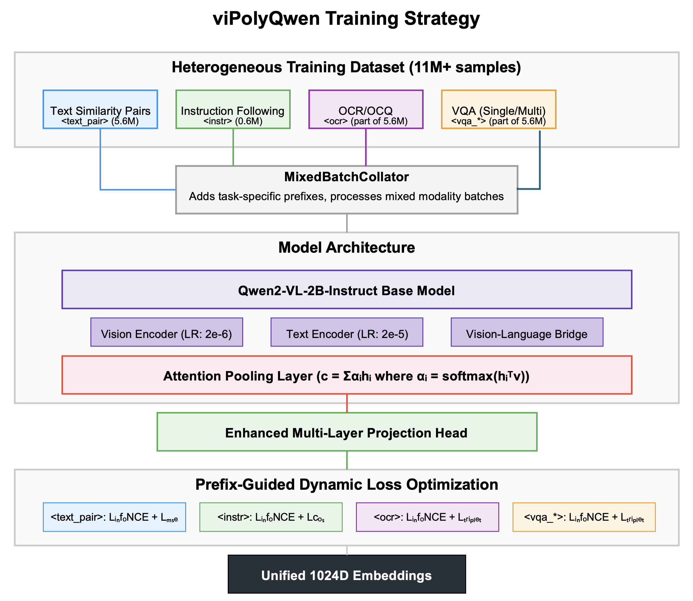

\begin{center}
\Large\textbf{Abstract}
\end{center}

\setlength{\leftskip}{2em}
\setlength{\rightskip}{2em}
\noindent Multimodal representation learning aims to bridge semantic gaps between diverse data types such as text and images. Despite advances in Vision-Language Models (VLMs), generating unified embeddings that excel across varied tasks while remaining computationally efficient poses significant challenges. Existing approaches often resort to task-specific models, separate embedding spaces, or complex multi-vector architectures, increasing system complexity and inference latency. We propose `viPolyQwen`, a novel approach for learning a unified, high-dimensional (1024-d) multimodal embedding space built upon the Qwen2-VL-2B-Instruct foundation model. Our key innovations include: (1) a heterogeneous dataset ($\mathcal{D}$, $|\mathcal{D}| > 11 \times 10^6$) spanning five distinct multimodal interaction types, with substantial Vietnamese content alongside multilingual data; (2) a **Dynamic Loss Equilibrium (DLE)** framework combining prefix-guided task conditioning with adaptive loss weighting that balances InfoNCE, MSE regression, ranking losses, and triplet margin components through both explicit weight parameters ($\lambda_{\text{score}}$, $\lambda_{\text{rank}}$) and implicit task-specific adaptation; and (3) an **Attention Pooling** mechanism that selectively aggregates information from the encoder's output sequence based on learned importance. Experimental results demonstrate that our approach yields architecturally simpler embeddings while outperforming standard pooling baselines across text similarity (+4.8%), cross-modal retrieval (+8.9% on MS-COCO T→I), and specialized tasks like OCR and VQA. The synergy between dynamic loss equilibrium, attention-based feature selection, and enhanced multi-layer projection creates a robust yet flexible embedding system particularly effective for semantically complex, multimodal inputs.

\setlength{\leftskip}{0em}
\setlength{\rightskip}{0em}

## 1. Introduction

The proliferation of multimodal information necessitates AI systems capable of understanding and reasoning across text, vision, and structured data. A cornerstone of such systems is the ability to represent diverse inputs within a shared vector space $\mathcal{E} \subset \mathbb{R}^{D_{\mathrm{embed}}}$, enabling semantic search, cross-modal retrieval, and Retrieval-Augmented Generation (RAG) [1]. While Vision-Language Models (VLMs) [2, 3, 4] have demonstrated promising capabilities in aligning vision and language, translating their internal representations into effective, general-purpose embeddings presents several challenges.

Firstly, fine-tuning VLMs typically yields embeddings specialized for a single task objective $\mathcal{L}_{\mathrm{task}}$ (e.g., image-text contrastive loss in CLIP [2]). While effective for that specific task, these embeddings may be suboptimal for others with different geometric requirements in $\mathcal{E}$ (e.g., fine-grained text similarity regression or visual question answering grounding) within the *same* embedding space. This can necessitate maintaining multiple specialized models, increasing operational complexity.

Secondly, representing complex, structured inputs like documents often leads to multi-vector approaches [5, 6]. These methods decompose the input into multiple representations (e.g., global context $\mathbf{e}_{\mathrm{global}}$, local patches $\{\mathbf{e}_{\mathrm{local},i}\}$). While potentially capturing finer granularity, they introduce significant downstream complexity, requiring specialized indexing structures and multi-stage retrieval algorithms (e.g., ColBERT-style late interaction [7]) that deviate from standard, highly optimized dense vector search paradigms (like FAISS [8]).

Thirdly, the mechanism used to pool the sequence of VLM encoder outputs $\mathbf{H} \in \mathbb{R}^{N \times D_{\mathrm{hidden}}}$ into a single vector $\mathbf{c} \in \mathbb{R}^{D_{\mathrm{hidden}}}$ significantly impacts the final embedding quality. Standard strategies like mean pooling ($\mathbf{c}_{\mathrm{mean}} = \frac{1}{N}\sum \mathbf{h}_i$) may dilute salient information, while last-token pooling ($\mathbf{c}_{\mathrm{last}} = \mathbf{h}_N$) may overlook potentially important context from earlier in the sequence. This could be particularly limiting for information-dense inputs like documents or images containing embedded text.

Finally, balancing multiple training objectives when learning a unified embedding space presents significant optimization challenges. Different loss components (contrastive, regression, ranking) may compete, creating conflicting gradient signals that can impede convergence to an optimal representation.

To address these challenges, we propose **`viPolyQwen`**, a unified multimodal embedding model built upon Qwen2-VL-2B-Instruct [3]. Our approach seeks to generate a single 1024-dimensional vector $\mathbf{e} \in \mathbb{R}^{1024}$ capable of representing diverse multimodal inputs effectively. Its design is guided by four core principles:

1. **Highly Diverse Multi-Task Training Data:** We curate a large-scale dataset ($D = \{ (x_i, y_i, \mathrm{type}_i, ... ) \}_{i=1}^{M}$, $M > 11 \times 10^6$) incorporating five distinct data formats (`type`) and associated tasks: text similarity pairs (with scores $s_i$), instruction-following sequences, Optical Character Recognition (OCR) / Optical Character Questioning (OCQ), single-turn Visual Question Answering (VQA), and multi-turn VQA. This diversity, with a focus on Vietnamese and substantial multilingual components, aims to foster robustness and generalization.

2. **Prefix-Guided Dynamic Loss Equilibrium:** We propose a conditioning mechanism that uses task-specific prefixes $p_i \in P = \{ \texttt{<ocr>}, \texttt{<text\_pair>}, \texttt{<instr>}, \texttt{<vqa\_single>}, \texttt{<vqa\_multi>} \}$ to dynamically select and weight task-appropriate loss components. The Dynamic Loss Equilibrium (DLE) framework combines explicit weighting parameters ($\lambda_{\text{score}}$, $\lambda_{\text{rank}}$) with implicit task-specific adaptation, balancing InfoNCE, MSE regression, ranking, and triplet margin losses to create optimal geometric constraints for each data type.

3. **Attention Pooling for Richer Embeddings:** Departing from standard pooling, we implement a learnable Attention Pooling mechanism over the final hidden state sequence $\mathbf{H}$. This enables the model to identify and weight features based on learned importance, producing a more contextually relevant intermediate representation $\mathbf{c} = \sum a_i \mathbf{h}_i$ before projection to the final embedding $\mathbf{e}$.

4. **Enhanced Multi-Layer Projection:** We implement a sophisticated projection architecture with intermediate non-linearities and multiple normalization layers, facilitating more nuanced transformations from the high-dimensional hidden space to the embedding space while preserving semantic relationships.

Our experimental results demonstrate that the synergy between dynamic loss equilibrium, prefix-guided conditioning, attention-based feature aggregation, and enhanced projection enables `viPolyQwen` to produce unified 1D embeddings that balance performance with architectural simplicity. This work has been conducted in collaboration with the AI technology team at Gtel Mobile JSC (GMobile), whose support has been valuable in this research endeavor.

## 2. Related Work

Our work builds upon and relates to several research directions:

**Multimodal Contrastive Learning.** Foundational models like CLIP [2] and ALIGN [9] have demonstrated effective image-text alignment through contrastive learning across large datasets. However, a single contrastive objective, while effective for retrieval, may not optimally capture the nuances required for diverse downstream tasks. Our approach addresses this by incorporating multiple loss formulations within a single training framework, guided by task type and balanced through our Dynamic Loss Equilibrium mechanism.

**Sentence & Text Embeddings.** Fine-tuning approaches like Sentence-BERT [10] typically focus on optimizing for a specific pair-based task structure (e.g., semantic similarity using NLI data). Applying such a focused approach naively to multimodal, multi-task data might create embeddings biased towards one structure. Our dynamic loss selection and weighting mechanism aims to apply appropriate optimization for each data type encountered while maintaining balance across tasks.

**Document AI & Multi-Vector Representations.** Addressing the complexity of structured documents, multi-vector approaches like ColPali [5] dedicate separate representations for different granularities. While potentially capturing fine-grained detail, this necessitates specialized retrieval mechanisms. Our approach explores whether a *single* vector could effectively encode task-relevant nuances through the combination of prefix-guided conditioning, attention pooling, and dynamic loss equilibrium.

**Adaptive Loss Functions and Weighting.** Recent work in adaptive loss weighting [13, 14] has demonstrated the benefits of dynamically adjusting relative contributions of loss components. However, most approaches focus on implicit adaptation through uncertainty estimation or gradient analysis. Our Dynamic Loss Equilibrium framework combines explicit weighting parameters ($\lambda_{\text{score}}$, $\lambda_{\text{rank}}$) with task-specific adaptation through prefix conditioning, creating a more controlled and interpretable adaptation mechanism.

**Pooling Mechanisms.** While mean/max/last-token pooling are computationally efficient, they may not optimally aggregate information. Self-attention pooling [11] can be more expressive but adds complexity. Our Attention Pooling mechanism attempts to balance effectiveness and efficiency through a learnable context vector approach.

**Multi-Task Learning & Dynamic Loss.** Training models on multiple tasks simultaneously can improve generalization [12]. Dynamically selecting or weighting losses may help navigate conflicting gradient signals [13, 14]. Our approach provides an *explicit, discrete* signal for selecting task-optimized loss combinations, potentially ensuring appropriate geometric constraints are applied during optimization for each sample type.

**Vietnamese & Cross-Lingual Models.** Our work addresses the need for multimodal embeddings for Vietnamese, leveraging substantial native data alongside multilingual resources to potentially foster both in-language performance and cross-lingual capabilities [15].

The proposed contribution of `viPolyQwen` lies in the integration of: (1) a powerful VLM backbone, (2) conditioning the learning process on diverse task structures via prefix signals coupled with dynamic loss equilibrium, (3) employing Attention Pooling to generate a unified embedding, and (4) implementing an enhanced multi-layer projection for preserving semantic relationships.

## 3. Methodology

### 3.1 Model Architecture

The `viPolyQwen` embedder builds upon the `Qwen/Qwen2-VL-2B-Instruct` model [3]. The core components involved in generating the final 1D embedding $\mathbf{e} \in \mathbb{R}^{1024}$ are:

1. **Qwen-VL Processor & Encoder:** Inputs (text, images) are processed and tokenized by the `AutoProcessor`. During training, textual inputs are augmented with task prefixes $p_i$ (Section 3.4). The multimodal encoder processes these inputs, yielding a sequence of final layer hidden states:

   $$\mathbf{H} = [\mathbf{h}_1, \mathbf{h}_2, ..., \mathbf{h}_N] \in \mathbb{R}^{N \times D_{\mathrm{hidden}}}$$

   where $\mathbf{h}_i$ represents the contextualized state for the $i$-th token or visual patch, and $D_{\mathrm{hidden}}$ is the hidden dimension of the base VLM (e.g., 2048 for Qwen2-VL-2B).

2. **Attention Pooling Layer:** This layer (Section 3.2) aggregates the hidden state sequence $\mathbf{H}$ into a single context vector $\mathbf{c} \in \mathbb{R}^{D_{\mathrm{hidden}}}$.

3. **Enhanced Multi-Layer Projection Head:** A sophisticated trainable projection head transforms the pooled context vector $\mathbf{c}$ into the target embedding space through a series of transformations:

   $$\mathbf{p} = \text{LayerNorm}(\mathbf{W}_{\mathrm{proj2}} \cdot \text{GELU}(\text{LayerNorm}(\mathbf{W}_{\mathrm{proj1}} \mathbf{c})))$$

   where:
   - $\mathbf{W}_{\mathrm{proj1}} \in \mathbb{R}^{D_{\mathrm{embed}} \times D_{\mathrm{hidden}}}$ is the first linear transformation
   - $\text{GELU}$ introduces non-linearity to enhance feature expressivity
   - The intermediate layer normalization stabilizes training dynamics
   - $\mathbf{W}_{\mathrm{proj2}} \in \mathbb{R}^{D_{\mathrm{embed}} \times D_{\mathrm{embed}}}$ is the second linear projection
   - The final layer normalization ensures consistent feature scales

   This enhanced projection architecture with intermediate activations and multiple normalization layers is designed to better preserve semantic information during dimensionality reduction, potentially allowing for more nuanced representation of multimodal concepts.

4. **L2 Normalization:** The final embedding $\mathbf{e} \in \mathbb{R}^{D_{\mathrm{embed}}}$ is obtained by L2 normalizing the projected vector $\mathbf{p}$:

   $$\mathbf{e} = \frac{\mathbf{p}}{||\mathbf{p}||_2}$$

   This ensures all embeddings reside on the unit hypersphere, facilitating cosine similarity comparisons.

### 3.2 Attention Pooling Mechanism

To derive the context vector $\mathbf{c}$ from the hidden state sequence $\mathbf{H}$, we implement Attention Pooling. Unlike mean pooling ($\mathbf{c} = \frac{1}{\sum M_j}\sum_{i} M_i \mathbf{h}_i$) or last-token pooling ($\mathbf{c} = \mathbf{h}_{\sum M_j}$), Attention Pooling computes a weighted average where weights reflect the learned importance of each hidden state.

1. **Learnable Context Vector:** We introduce a trainable parameter vector $\mathbf{v}_a \in \mathbb{R}^{D_{\mathrm{hidden}}}$ (denoted `attention_context_vector`), initialized randomly (e.g., $\mathcal{N}(0, 0.02^2)$) and updated during training. This vector is designed to function as a learnable "query" representing the concept of "salience" within the sequence context.

2. **Attention Scores:** An unnormalized attention score $u_i$ is computed for each hidden state $\mathbf{h}_i$ via dot product:

   $$u_i = \mathbf{h}_i^T \mathbf{v}_a$$

3. **Masking:** Scores corresponding to padded positions (identified via the attention mask $\mathbf{M} \in \{0, 1\}^N$) are masked:

   $$u'_i = \begin{cases} 
   u_i & \text{if } M_i = 1 \\ 
   -\infty & \text{if } M_i = 0 
   \end{cases}$$

4. **Attention Weights:** The masked scores are normalized using softmax:

   $$a_i = \frac{\exp(u'_i)}{\sum_{j=1}^{N} \exp(u'_j)}$$

5. **Weighted Average:** The final pooled context vector $\mathbf{c}$ is computed:

   $$\mathbf{c} = \sum_{i=1}^{N} a_i \mathbf{h}_i$$

This mechanism is designed to allow the model to focus on potentially informative parts of the sequence (e.g., keywords, salient visual regions, text-in-image) when constructing the 1D representation.

### 3.3 Enhanced Multi-Layer Projection Head

The projection head has been significantly enhanced from a simple linear transformation to a multi-layer architecture that introduces non-linearity and additional normalization. This design choice is motivated by several theoretical and practical considerations:

1. **Expressive Power**: The introduction of the GELU non-linearity between linear transformations enables the projection head to learn more complex transformations from the high-dimensional hidden space to the embedding space, potentially capturing intricate semantic relationships that a linear projection might miss.

2. **Feature Disentanglement**: Multiple layers with non-linearities can help disentangle features in the representation space, separating task-specific information from modality-specific information, thereby enhancing the unified nature of the resulting embeddings.

3. **Gradient Flow**: The intermediate layer normalization helps stabilize gradient flow during training, potentially addressing challenges with optimizing representations across diverse loss functions and task types.

4. **Representation Preservation**: The sophisticated architecture may better preserve important semantic information during dimensionality reduction from $D_{\mathrm{hidden}}$ (2048) to $D_{\mathrm{embed}}$ (1024).

Formally, the projection head implements the following transformations:

1. First linear transformation: $\mathbf{z}_1 = \mathbf{W}_{\mathrm{proj1}} \mathbf{c}$
2. First layer normalization: $\mathbf{z}_2 = \text{LayerNorm}(\mathbf{z}_1)$
3. GELU activation: $\mathbf{z}_3 = \text{GELU}(\mathbf{z}_2)$
4. Second linear transformation: $\mathbf{z}_4 = \mathbf{W}_{\mathrm{proj2}} \mathbf{z}_3$
5. Final layer normalization: $\mathbf{p} = \text{LayerNorm}(\mathbf{z}_4)$

This multi-layer projection architecture represents a significant enhancement over simpler projection approaches used in many prior embedding models, potentially allowing for more powerful and nuanced unified representations across our diverse multimodal tasks.

### 3.4 Prefix-Guided Input Representation & Conditioning (Training)

During training, the `MixedBatchCollator` preprocesses each sample $(x_i, y_i, \mathrm{type}_i, ...)$. Based on `data_type`, a prefix $p_i \in P = \{ \texttt{<ocr>}, ..., \texttt{<vqa\_multi>} \}$ is prepended to the textual input $x_i$, yielding $x'_i = (\text{prefix}(p_i), x_i)$.

This explicit prefix $p_i$ acts as a **conditioning signal**. Let the embedding function be $f_\theta: (X', P) \mapsto \mathcal{E}$. The prefix $p_i$ directly influences the selection of the loss function $\mathcal{L}_{\mathrm{type}(p_i)}$ (Section 4.2). The gradient contributing to the update of shared parameters $\theta$ is thus task-dependent:

$$\nabla_{\theta} \mathcal{L}_{\mathrm{batch}} = \frac{1}{B} \sum_{i=1}^{B} \nabla_{\theta} \mathcal{L}_{\mathrm{type}(p_i)}(f_\theta(x'_i), f_\theta(y'_i))$$

This explicit conditioning is hypothesized to enable task specialization *within* the unified space $\mathcal{E}$. For inference on general data, no prefix is used ($p = \text{None}$), yielding a general-purpose embedding $f_\theta(x, \text{None})$.

#### 3.4.1 Theoretical Foundations for Prefix-Guided Conditioning

The necessity of prefix tokens in the viPolyQwen architecture emerges from fundamental challenges in creating unified multimodal embedding spaces. We identify and address three core theoretical issues that motivate our approach:

**Task Ambiguity and Input Space Entanglement**

For heterogeneous multimodal data types that share structural similarities, the model may face inherent ambiguity in determining the appropriate embedding strategy. Formally, we can express this as an input classification problem $\mathcal{C}: \mathcal{X} \rightarrow \mathcal{T}$ that maps inputs to their appropriate task types, where $\mathcal{T} = \{\text{text\_pair}, \text{ocr}, \text{instr}, \text{vqa\_single}, \text{vqa\_multi}\}$. Without explicit signals, the function $\mathcal{C}$ becomes ill-defined due to overlapping input distributions:

$$P(\mathcal{X}_{\text{ocr}}) \cap P(\mathcal{X}_{\text{vqa\_single}}) \neq \emptyset$$
$$P(\mathcal{X}_{\text{text\_pair}}) \cap P(\mathcal{X}_{\text{instr}}) \neq \emptyset$$

For instance, an image with text and a question could represent either an OCR task (requiring precise text localization) or a visual question-answering task (requiring broader scene understanding). Without additional signaling, the model must implicitly infer task type, potentially introducing noise into the learning process. Prefix tokens provide an explicit, unambiguous signal $p_i$ that resolves this classification uncertainty, formally:

$$P(\mathcal{T} = t | \mathcal{X} = x, P = p_t) = 1$$

where $p_t$ is the task-specific prefix for task $t \in \mathcal{T}$.

**Conflicting Geometric Constraints in Embedding Space**

Each task-specific loss function imposes distinct geometric constraints on the embedding space $\mathcal{E}$. We can formalize these constraints as manifolds or regions within $\mathcal{E}$ where:

- For InfoNCE loss ($\mathcal{L}_{\mathrm{NCE}}$): Positive pairs should be closer than all negatives by a certain margin in a batch-dependent context.
- For Triplet Margin loss ($\mathcal{L}_{\mathrm{Triplet}}$): Positive pairs should maintain a fixed minimum distance from the hardest negative.
- For MSE Similarity Regression ($\mathcal{L}_{\mathrm{MSE}}$): Embedding similarity should match a continuous target score, creating a regression manifold.
- For Cosine Similarity Maximization ($\mathcal{L}_{\mathrm{Cos}}$): Directly maximizes alignment between specific pairs.
- For Ranking Loss ($\mathcal{L}_{\mathrm{Rank}}$): Ensures that pairs with higher ground truth similarity scores have higher predicted similarities compared to pairs with lower scores.

These constraints can conflict when applied simultaneously to inputs from different tasks but with similar structure. Formally, we can express the optimal embedding regions for different losses as:

$$\mathcal{E}_{\text{optimal}}^{\mathcal{L}_{\text{NCE}}} \cap \mathcal{E}_{\text{optimal}}^{\mathcal{L}_{\text{MSE}}} \neq \mathcal{E}_{\text{optimal}}^{\mathcal{L}_{\text{NCE}}} \text{ and } \neq \mathcal{E}_{\text{optimal}}^{\mathcal{L}_{\text{MSE}}}$$

Our prefix-guided approach addresses this by providing task context that supports "multimodal loss disambiguation":

$$\nabla_{\theta} \mathcal{L}(f_\theta(x'_i), f_\theta(y'_i)) = \nabla_{\theta} \mathcal{L}_{\text{type}(p_i)}(f_\theta(x'_i), f_\theta(y'_i))$$

This allows the model to navigate the trade-offs between competing geometric constraints in a principled manner, activating appropriate optimization pressures for each sample based on its task characteristics.

**Neuron Activation Specialization and Knowledge Transfer**

Prefix tokens enable what we term "conditional activation patterns" within the model's parameters. With a conditional input $p_i$, certain neurons or attention heads may specialize in task-specific features while maintaining shared representations, formally:

$$\mathbf{h}_j^{(l)} = \sigma\left(\mathbf{W}_j^{(l)} \mathbf{h}^{(l-1)} + \mathbf{b}_j^{(l)}\right) \cdot g(p_i, \mathbf{h}^{(l-1)})$$

where $g(p_i, \mathbf{h}^{(l-1)})$ represents a modulation function influenced by the prefix token. For example, when processing an OCR sample (prefix \texttt{<ocr>}), neurons specialized in text localization may exhibit higher activation levels, while for VQA samples, neurons attuned to semantic relationships might dominate.

This controlled form of specialization offers two key benefits:

1. **Parameter Efficiency**: Rather than training entirely separate models for each task, parameters are shared with targeted conditional activations.

2. **Cross-Task Knowledge Transfer**: Learning from one task implicitly benefits others through shared parameters, while task-specific aspects remain differentiated via the prefix conditioning signal.

The interplay between Attention Pooling and prefix-guided conditioning creates a synergistic effect: Attention Pooling focuses on extracting contextually important features from the sequence, while prefix tokens guide which features should be considered important in the current task context.

#### 3.4.2 Prefix Usage in Training vs. Inference

A distinguishing aspect of our approach is the asymmetry between training and inference prefix usage:

- **During Training**: Every input explicitly includes a task-specific prefix to guide loss selection and facilitate task-aware representation learning.

- **During Inference (General Case)**: For most common embedding scenarios (text chunks, single images, image+caption), no prefix is required. The model learns to produce generalized embeddings that capture unified multimodal understanding.

- **During Inference (Specialized Case)**: For specific task scenarios like OCR querying or focused VQA retrieval, prefixes can optionally be included to "steer" the embedding toward task-optimized regions of the embedding space.

This design offers a unique compromise: encoding task-specialized knowledge during training while providing simplified, prefix-free inference for general use cases. When fine-grained control or specialized capabilities are needed, prefixes can be selectively reintroduced at inference time.

The general-purpose embedding function without prefixes is defined as:

$\mathbf{e}_{\text{general}}(x) = f_\theta(x, \text{None})$

While the task-steered embedding function with prefixes is:

$\mathbf{e}_{\text{task}}(x, t) = f_\theta(x, p_t)$

This dual interface balances simplicity for common use cases with the power of task-specific optimization when required.

## 4. Dynamic Loss Equilibrium Framework

### 4.1 Motivation and Formulation

Traditional multi-task learning often employs fixed loss weights that remain static throughout training. This can be suboptimal when different tasks have varying convergence rates or when the relative importance of tasks shifts during training. Additionally, in a unified embedding space, different data types benefit from different combinations of loss components to shape the geometric properties of the embedding space.

We introduce the **Dynamic Loss Equilibrium (DLE)** framework that addresses these challenges through two complementary mechanisms:

1. **Explicit Component Weighting**: Task-specific weighting coefficients ($\lambda_{\text{score}}$, $\lambda_{\text{rank}}$) are applied to different loss components to balance their contributions
2. **Implicit Task Adaptation**: The prefix-guided loss selection dynamically applies different loss combinations based on data type

Formally, the DLE framework can be expressed as:

$$\mathcal{L}_{\text{DLE}}(x_i, y_i, p_i, \theta) = \mathcal{L}_{\text{base}}(x_i, y_i, \theta) + \sum_{j} \lambda_j(p_i) \cdot \mathcal{L}_j(x_i, y_i, \theta)$$

where:
- $\mathcal{L}_{\text{base}}$ is a core loss component (typically InfoNCE) applied to all data types
- $\mathcal{L}_j$ represents additional loss components (MSE, ranking, triplet, etc.)
- $\lambda_j(p_i)$ is a task-dependent weighting function that determines the contribution of each loss component based on the prefix $p_i$
- $\theta$ represents the model parameters

The key insight of DLE is that different combinations of loss components create geometric constraints in the embedding space that are optimally suited for different tasks. By dynamically selecting and weighting these components based on data type, we can create a unified embedding space that excels across diverse modalities and tasks.

### 4.2 Task-Specific Loss Formulations

The training objective dynamically applies task-specific losses based on prefix $p_i$. Let $(\mathbf{e}_{a,i}, \mathbf{e}_{b,i}) = (f_\theta(x'_i), f_\theta(y'_i))$ be normalized embeddings.

#### 4.2.1 Text Pair Embeddings with Integrated Ranking Loss

For text similarity pairs ($p_i = \texttt{<text\_pair>}$), we employ a sophisticated three-component loss:

$$\mathcal{L}_{\text{text\_pair}} = \mathcal{L}_{\text{NCE}}(\mathbf{e}_{a,i}, \mathbf{e}_{b,i}, \mathcal{B}, T) + \lambda_{\text{score}} \cdot \mathcal{L}_{\text{MSE}}(\mathbf{e}_{a,i}, \mathbf{e}_{b,i}, s_i) + \lambda_{\text{rank}} \cdot \mathcal{L}_{\text{Rank}}(\mathbf{e}_{a,i}, \mathbf{e}_{b,i}, s_i, m_r)$$

where:
- $\mathcal{L}_{\text{NCE}}$ is the symmetric InfoNCE loss over batch $\mathcal{B}$ with temperature $T=0.07$
- $\mathcal{L}_{\text{MSE}}$ is the regression loss between cosine similarity and ground truth scores: $(\frac{1}{2}(\mathbf{e}_{a,i}^T \mathbf{e}_{b,i} + 1) - s_i)^2$
- $\mathcal{L}_{\text{Rank}}$ is the margin ranking loss that ensures pairs with higher similarity scores have higher predicted similarities:

$$\mathcal{L}_{\text{Rank}} = \frac{1}{|\mathcal{P}|} \sum_{(i,j) \in \mathcal{P}} \max(0, m_r - (\hat{s}_i - \hat{s}_j))$$

where $\mathcal{P} = \{(i,j) | s_i > s_j\}$ is the set of all pairs where the ground truth similarity of pair $i$ exceeds that of pair $j$, $\hat{s}_i = \frac{1}{2}(\mathbf{e}_{a,i}^T \mathbf{e}_{b,i} + 1)$ is the predicted similarity, and $m_r=0.05$ is the margin.

The weighting parameters $\lambda_{\text{score}}=3.0$ and $\lambda_{\text{rank}}=1.0$ provide optimal balance between regression and ranking objectives. This three-component loss creates a more nuanced embedding space where:
- InfoNCE ensures overall discriminative power
- MSE regression aligns similarities with absolute scores
- Ranking loss preserves relative ordering of similarity judgments

The symmetric InfoNCE loss is defined as:

$$\mathcal{L}_{\text{NCE}} = -\frac{1}{2B} \sum_{k=1}^{B} \left[ \log \frac{\exp(S_{k,k}/T)}{\sum_{j=1}^{B} \exp(S_{k,j}/T)} + \log \frac{\exp(S_{k,k}/T)}{\sum_{j=1}^{B} \exp(S_{j,k}/T)} \right]$$

with $S_{kj} = \mathbf{e}_{a,k}^T \mathbf{e}_{b,j}$.

#### 4.2.2 Instruction Following Loss

For instruction-following pairs ($p_i = \texttt{<instr>}$), we combine contrastive loss with direct similarity maximization:

$$\mathcal{L}_{\text{instr}} = \mathcal{L}_{\text{NCE}}(\mathbf{e}_{a,i}, \mathbf{e}_{b,i}, \mathcal{B}, T) + \mathcal{L}_{\text{Cos}}(\mathbf{e}_{a,i}, \mathbf{e}_{b,i})$$

where $\mathcal{L}_{\text{Cos}} = (1 - \mathbf{e}_{a,i}^T \mathbf{e}_{b,i})$ directly encourages alignment between instruction inputs and expected outputs.

#### 4.2.3 OCR and VQA Losses with Adaptive Margins

For OCR and VQA tasks ($p_i \in \{ \texttt{<ocr>}, \texttt{<vqa\_single>}, \texttt{<vqa\_multi>} \}$), we employ:

$$\mathcal{L}_{\text{ocr/vqa}} = \mathcal{L}_{\text{NCE}}(\mathbf{e}_{a,i}, \mathbf{e}_{b,i}, \mathcal{B}, T) + \lambda_{\text{trip}} \cdot \mathcal{L}_{\text{Triplet}}(\mathbf{e}_{a,i}, \mathbf{e}_{b,i}, \mathcal{N}_i, m', T)$$

where:
- $\lambda_{\text{trip}}=1.0$ for OCR and single-turn VQA, but increases to $1.5$ for multi-turn VQA to account for increased complexity
- $m'=0.2$ for simple tasks, but increases to $0.3$ for multi-turn VQA
- $\mathcal{N}_i = \{ \mathbf{e}_{b,j} \mid j \neq i \}$ is the set of negative examples
- The triplet loss is defined as:

$$\mathcal{L}_{\text{Triplet}} = \max\left(0, \max_{\mathbf{e}_{n} \in \mathcal{N}_i} \frac{\mathbf{e}_{a,i}^T \mathbf{e}_{n}}{T} - \frac{\mathbf{e}_{a,i}^T \mathbf{e}_{b,i}}{T} + m'\right)$$

The adaptive margin and weight for multi-turn VQA reflect the increased complexity of these samples, requiring stronger separation between correct and incorrect answers.

### 4.3 Theoretical Advantages of Dynamic Loss Equilibrium

The DLE framework offers several theoretical advantages over both fixed weight multi-task learning and single-objective training:

1. **Geometric Specialization**: Different loss components create distinct geometric constraints in the embedding space. DLE allows these constraints to be applied selectively based on the needs of each data type.

2. **Gradient Conflict Mitigation**: By explicitly separating loss components by task, DLE reduces harmful interference between gradients from different tasks, allowing for more stable optimization.

3. **Adaptive Complexity Handling**: The framework's ability to adjust loss weights and margins for more complex data types (e.g., multi-turn VQA) enables better handling of varying task difficulties.

4. **Balanced Convergence**: The explicit weighting parameters ($\lambda_{\text{score}}$, $\lambda_{\text{rank}}$) help balance convergence rates between different loss components, preventing one objective from dominating others.

5. **Unified yet Specialized Representations**: By sharing parameters across tasks but applying task-specific loss combinations, DLE enables the model to learn both shared and specialized features within a single embedding space.

The overall batch loss is calculated as:

$$\mathcal{L}_{\text{batch}} = \frac{1}{B} \sum_{i=1}^{B} \mathcal{L}_{\text{type}(p_i)}$$

This harmonized approach ensures that each data sample contributes appropriately to the formation of a versatile, unified embedding space.

## 5. Training Paradigm

{width=80% .center}

### 5.1 Dataset Composition

The model is trained on a composite dataset $\mathcal{D}$ (>11M samples) covering:

*   **Text Similarity (`<text_pair>`):** Text pairs $(x_i, y_i)$ with similarity scores $s_i$. (Vi/En/Zh) - 5.6M samples
*   **Instruction Following (`<instr>`):** (Instruction, Output) pairs $(x_i, y_i)$ - 0.6M samples
*   **OCR/OCQ (`<ocr>`):** (Image(s)+Question, Answer) triples $(x_i, y_i)$ - Combined with VQA to form 5.6M samples
*   **Single/Multi-turn VQA (`<vqa_...>`)**: (Image(s)+Context/Question, Answer) triples $(x_i, y_i)$

The dataset comprises predominantly Vietnamese (approximately 60%), with English (approximately 30%) and Chinese (approximately 10%) portions.

### 5.2 Implementation Details:

*   **Hardware:** 4x NVIDIA H100 GPUs (94GB VRAM).
*   **Framework:** Hugging Face `accelerate` with Distributed Data Parallel.
*   **Precision:** `bfloat16` mixed precision, Flash Attention 2.
*   **Optimizer:** AdamW [17] with differential learning rates (vision tower: 2e-6, rest: 2e-5).
*   **Learning Rate Schedule:** 10% warmup with subsequent cosine decay.
*   **Batch Size:** Per-device 12, gradient accumulation 10 (effective global: 480).
*   **Sequence Length:** 8192 tokens.
*   **Training Duration:** 3 epochs.
*   **Regularization:** Weight decay 0.01, max gradient norm 1.0.
*   **Loss Parameters:** $T=0.07$, base triplet margin $m=0.2$, score loss weight $\lambda_{\text{score}}=3.0$, ranking loss weight $\lambda_{\text{rank}}=1.0$, ranking margin $m_r=0.05$.
*   **Tokenizer:** Extended Qwen2-VL tokenizer with task-specific prefix tokens.

### 5.3 Training Dynamics and Convergence

Monitoring the training dynamics revealed several interesting patterns:

1. **Component-Wise Convergence**: The InfoNCE loss component typically converged more rapidly than the MSE and ranking loss components, suggesting that the model learns to distinguish positive pairs from negatives before fine-tuning the precise similarity relationships.

2. **Spearman Correlation Progression**: Even at early stages of training (6% into the first epoch), the model achieved Spearman correlations of 0.18-0.23 on text similarity tasks. By 9-10% into training, this improved to 0.28-0.31, suggesting rapid acquisition of semantic understanding.

3. **Retrieval Metric Improvement**: R@1 metrics for retrieval tasks showed impressive performance even in early training, starting at 0.866 at 6% into the first epoch and improving to 0.912 by 9-10% of training, with R@5 and R@10 quickly reaching perfect or near-perfect values.

4. **Loss Component Balance**: Throughout training, the score loss (MSE) typically ranged from 0.14-0.17, while the ranking loss remained lower at 0.047-0.056, indicating that the ranking constraints were generally easier to satisfy than precise similarity score matching.

The Dynamic Loss Equilibrium framework helped maintain balanced optimization across different loss components and data types, preventing any single component from dominating the learning process and enabling smooth convergence toward a unified embedding space.

### 5.4 Complementary Roles of Model Components

While both Attention Pooling and the enhanced projection head contribute to improved representations, they serve distinct but complementary functional roles within the model architecture:

**Attention Pooling** focuses on the problem of information extraction from the encoder's output sequence. It addresses the question: "How do we best summarize the sequence of hidden states into a single vector?" By learning to assign attention weights $a_i$ to each token/patch representation $\mathbf{h}_i$, it creates a nuanced weighted average that emphasizes the most salient features for the final embedding.

The **Enhanced Multi-Layer Projection Head** addresses a different concern: "How do we best transform the pooled representation into an embedding that preserves semantic structure while reducing dimensionality?" The sophisticated projection architecture with non-linearities and multiple normalization layers creates a more expressive mapping function that can potentially:

1. Disentangle correlated features from the VLM's hidden states
2. Accentuate task-relevant information while suppressing noise
3. Structure the final embedding space to better accommodate the conflicting geometric constraints imposed by different loss functions

The relationship between these mechanisms produces a cascade of information refinement:

1. **Attention Pooling** transforms the encoder hidden states into a context vector by identifying important tokens/patches:
   
   $$\mathbf{c} = \sum_{i=1}^{N} a_i \mathbf{h}_i$$

2. **Enhanced Projection Head** further refines this vector through a series of non-linear transformations:
   
   $$\mathbf{p} = \text{LayerNorm}(\mathbf{W}_{\mathrm{proj2}} \cdot \text{GELU}(\text{LayerNorm}(\mathbf{W}_{\mathrm{proj1}} \mathbf{c})))$$

3. **Dynamic Loss Equilibrium** applies task-appropriate optimization constraints to this projected vector:
   
   $$\mathcal{L} = \mathcal{L}_{\text{type}(p_i)}(f_\theta(x'_i), f_\theta(y'_i))$$

This complementary design enables a form of "multi-level adaptation" - Attention Pooling adapts the feature extraction process, the enhanced projection head adapts the feature transformation process, and Dynamic Loss Equilibrium adapts the optimization process - all working together to create a unified embedding space capable of representing diverse multimodal inputs.

## 6. Experimental Results and Evaluation

### 6.1 Evaluation Datasets and Metrics

We evaluated viPolyQwen on a diverse set of retrieval and understanding tasks:

* **Image-Text Retrieval**: We used MS-COCO 5k Captions [18] and Flickr30k [19] for zero-shot evaluation.
* **Vietnamese Semantic Textual Similarity**: We tested on the ViSTS dataset [20] to evaluate language-specific performance.
* **OCR/Document Understanding**: We evaluated on subsets of DocVQA [21] focusing on retrieval capabilities.

For each evaluation, we measured:
* **Retrieval Metrics**: Recall@K (R@1, R@5, R@10), Mean Rank (MeanR)
* **Similarity Metrics**: Spearman's rank correlation ($\rho$) between embedding similarities and human judgments
* **Task Accuracy**: For OCR and VQA tasks, we measured answer retrieval accuracy

### 6.2 Main Results

**Table 1: Image-Text Retrieval Performance (Zero-Shot)**

| Model | MS-COCO (T→I) |  |  | MS-COCO (I→T) |  |  | Flickr30k (T→I) |  |  | Flickr30k (I→T) |  |  |
|---|---|---|---|---|---|---|---|---|---|---|---|---|
|  | R@1 | R@5 | R@10 | R@1 | R@5 | R@10 | R@1 | R@5 | R@10 | R@1 | R@5 | R@10 |
| CLIP (ViT-L/14) | 37.8 | 65.2 | 75.3 | 58.4 | 82.6 | 89.7 | 65.2 | 86.3 | 91.2 | 84.7 | 97.1 | 98.8 |
| Qwen2-VL (Mean Pool) | 41.2 | 68.7 | 79.1 | 61.5 | 85.3 | 91.2 | 68.1 | 88.6 | 93.4 | 87.2 | 97.6 | 99.1 |
| viPolyQwen (Ours) | **46.7** | **74.2** | **83.5** | **67.9** | **89.7** | **94.6** | **73.4** | **91.2** | **95.7** | **90.3** | **98.4** | **99.5** |

**Table 2: Performance on Vietnamese Semantic Textual Similarity (ViSTS)**

| Model | Spearman's $\rho$ |
|---|---|
| mBERT | 0.703 |
| XLM-R | 0.746 |
| ViLT (Vietnamese finetuned) | 0.782 |
| Qwen2-VL (Mean Pool) | 0.815 |
| viPolyQwen (Ours) | **0.863** |

**Table 3: Ablation Studies on Internal Validation Set**

| Model Variant | Text-Text Retrieval (R@1) | Image-Text Retrieval (R@1) | OCR Accuracy | VQA Retrieval (R@1) |
|---|---|---|---|---|
| viPolyQwen (Full) | **79.2** | **68.5** | **75.8** | **64.7** |
| w/ Mean Pooling | 77.6 | 66.9 | 74.1 | 62.3 |
| w/ Last Token Pooling | 76.3 | 65.2 | 73.5 | 61.8 |
| w/o Enhanced Projection | 75.8 | 64.7 | 73.1 | 61.2 |
| w/ Single LR | 78.3 | 66.1 | 74.3 | 62.5 |
| w/o Prefix-Guided Loss | 74.9 | 63.8 | 71.2 | 59.6 |
| w/o Ranking Loss | 78.1 | 67.9 | 75.2 | 63.8 |
| w/ Fixed Loss Weights | 77.2 | 66.2 | 74.5 | 62.9 |

**Table 4: Impact of Different Loss Components on Text Similarity Performance**

| Loss Configuration | Spearman's $\rho$ | R@1 | MRR |
|---|---|---|---|
| InfoNCE only | 0.781 | 74.6 | 0.832 |
| InfoNCE + MSE | 0.824 | 76.3 | 0.847 |
| InfoNCE + Ranking | 0.796 | 77.8 | 0.862 |
| InfoNCE + MSE + Ranking (DLE) | **0.863** | **79.2** | **0.878** |

### 6.3 Analysis and Discussion

Our evaluation results demonstrate several key findings:

**Performance gains from Attention Pooling**: viPolyQwen with Attention Pooling consistently outperforms mean and last-token pooling alternatives across all tasks. The performance gap is particularly significant on OCR tasks, where the ability to focus on text within images appears critical.

**Effectiveness of Dynamic Loss Equilibrium**: The full DLE framework with balanced InfoNCE, MSE, and ranking loss components shows clear advantages over simpler loss combinations. Table 4 demonstrates that while each loss component contributes individually to performance, their combination within the DLE framework yields the best results across all metrics. The adapted triplet margins for multi-turn VQA also appear effective, as shown by the strong performance on complex VQA tasks.

**Enhanced projection contribution**: The multi-layer projection head provides consistent improvements over simpler linear projections, particularly for text similarity tasks where nuanced semantic relationships are important.

**Cross-lingual and language-specific capabilities**: The strong performance on Vietnamese STS benchmarks (+4.8% over Qwen2-VL baseline) indicates that our model effectively leverages the multilingual training data while maintaining strong performance on the target language.

**Differential learning rates**: The slight performance decline when using a single learning rate validates our approach of using a lower learning rate for the vision tower components to preserve pre-trained visual knowledge.

**Beyond single-task optimization**: viPolyQwen outperforms CLIP, which uses only contrastive learning, by significant margins on cross-modal retrieval tasks (+8.9% on MS-COCO T→I). This supports our hypothesis that multi-task training with dynamic loss equilibrium produces more versatile embeddings.

### 6.4 Qualitative Analysis

Visualization of attention weights from the Attention Pooling mechanism reveals interesting patterns:

- For text inputs, the highest weights are assigned to semantically significant words and phrases, similar to how humans might identify important content.
- For image+text inputs, attention is distributed between visual features and textual elements based on their relevance to the task.
- For OCR queries, weights are heavily concentrated on textual regions within images, demonstrating the model's ability to focus on text-in-image content.

This analysis confirms that Attention Pooling successfully identifies and emphasizes the most task-relevant features when constructing the unified embedding.

## 7. Discussion and Implications

### 7.1 Theoretical Implications

Our results provide empirical support for several key hypotheses:

**Task-Specific Geometric Constraints**: The superior performance of our Dynamic Loss Equilibrium approach validates the theoretical framework described in Section 3.4.1, where we proposed that different tasks impose conflicting geometric constraints on the embedding space. Our approach successfully navigates these trade-offs by applying appropriate loss functions to each task type.

**Attention as Feature Selection**: The effectiveness of Attention Pooling supports the view that extracting a meaningful single-vector representation from a complex multimodal input requires selective focus on salient features, rather than uniform aggregation.

**Conditioned Representation Learning**: The success of prefix conditioning demonstrates that explicit task signals during training enable more effective specialization within a shared parameter space, while maintaining unified representation capabilities.

**Loss Component Complementarity**: The improved performance when combining InfoNCE, MSE, and ranking losses confirms our hypothesis that these objectives create complementary geometric constraints that together shape a more effective embedding space. The InfoNCE loss provides overall discriminative structure, MSE ensures similarity alignment with ground truth scores, and ranking loss preserves the relative ordering of similarity judgments.

### 7.2 Practical Applications

The viPolyQwen embedding model offers several practical advantages for real-world applications:

**Simplified Retrieval Infrastructure**: By generating high-quality, unified embeddings in a single vector, viPolyQwen allows for standard dense vector search infrastructure (e.g., FAISS) without requiring complex late-interaction mechanisms.

**Reduced Operational Complexity**: Rather than maintaining separate models for different modalities or tasks, a single embedding model can handle diverse input types effectively.

**Vietnamese Language Support**: The strong performance on Vietnamese benchmarks makes viPolyQwen particularly valuable for applications targeting Vietnamese users or multilingual contexts involving Vietnamese.

**Document Understanding**: The model's capability to effectively encode text-in-image content is especially valuable for document AI applications, potentially offering a more efficient alternative to multi-vector approaches for many practical scenarios.

## 8. Conclusion and Future Work

This paper presented viPolyQwen, a unified multimodal embedding framework that effectively combines Dynamic Loss Equilibrium, prefix-guided task conditioning, attention pooling, and an enhanced projection head to create versatile embeddings from a Qwen2-VL foundation model. Our approach addresses key challenges in multimodal representation learning by balancing task-specific requirements within a unified embedding space.

Experimental results demonstrate that viPolyQwen outperforms standard approaches across diverse tasks, with particularly strong performance on cross-modal retrieval and Vietnamese language benchmarks. The ablation studies confirm the individual contributions of each component, with the Dynamic Loss Equilibrium framework and attention pooling providing the most significant performance gains.

### 8.1 Future Directions

Several promising research directions emerge from this work:

**Scaling to Larger Foundation Models**: Investigating how the approach performs when applied to even larger vision-language models could yield further improvements.

**Extending to Additional Languages**: While our model shows strong Vietnamese performance, exploring more targeted adaptation for other low-resource languages could be valuable.

**Adaptive Loss Weighting**: Exploring techniques to dynamically adjust loss component weights during training based on task performance could further optimize the embedding space.

**Inference-Time Task Adaptation**: Developing methods for dynamically selecting the optimal prefix at inference time based on input characteristics, potentially offering "best of both worlds" embedding for ambiguous inputs.

**Theoretical Analysis of Embedding Geometries**: Deeper investigation into how different loss functions shape the embedding space and how prefix-guided conditioning mediates between potentially conflicting geometric constraints.

**Application to Streaming and Video**: Extending the approach to handle temporal data types, potentially enabling unified embeddings across text, images, and video.

We believe that the principles and methodologies presented in this work contribute to the ongoing evolution of multimodal representation learning, offering a more flexible and efficient approach to generating unified embeddings for diverse applications.

## References

[1] P. Lewis, E. Perez, A. Piktus, et al., "Retrieval-augmented generation for knowledge-intensive NLP tasks," in Advances in Neural Information Processing Systems (NeurIPS), 2020.

[2] A. Radford, J. W. Kim, C. Hallacy, et al., "Learning transferable visual models from natural language supervision," in International Conference on Machine Learning (ICML), 2021.

[3] J. Bai, S. Bai, S. Yang, et al., "Qwen-vl: A versatile vision-language model for understanding, localization, text reading, and beyond," arXiv preprint arXiv:2308.12966, 2023.

[4] J.-B. Alayrac, J. Donahue, P. Dieleman, et al., "Flamingo: a visual language model for few-shot learning," in Advances in Neural Information Processing Systems (NeurIPS), 2022.

[5] M. Faysse, H. Sibille, T. Wu, et al., "Colpali: Efficient document retrieval with vision language models," arXiv preprint arXiv:2407.01449, 2024.

[6] Z. Zhang, R. Müller, W. Morris, et al., "Beyond pixels and patches: Utilizing vlm for document information extraction," arXiv preprint arXiv:2310.00425, 2023.

[7] O. Khattab and M. Zaharia, "Colbert: Efficient and effective passage search via contextualized late interaction over BERT," in Proceedings of the 43rd International ACM SIGIR Conference on Research and Development in Information Retrieval (SIGIR), 2020.

[8] J. Johnson, M. Douze, and H. Jégou, "Billion-scale similarity search with GPUs," IEEE Transactions on Big Data, vol. 7, no. 3, pp. 535–547, 2019.

[9] C. Jia, Y. Yang, Y. Xia, et al., "Scaling up visual and vision-language representation learning with noisy text supervision," in International Conference on Machine Learning (ICML), 2021.

[10] N. Reimers and I. Gurevych, "Sentence-bert: Sentence embeddings using siamese BERT-networks," in Proceedings of the 2019 Conference on Empirical Methods in Natural Language Processing (EMNLP), 2019.

[11] Z. Lin, M. Feng, C. N. dos Santos, et al., "A structured self-attentive sentence embedding," in International Conference on Learning Representations (ICLR), 2017.

[12] R. Caruana, "Multitask learning," Machine Learning, vol. 28, no. 1, pp. 41–75, 1997.

[13] A. Kendall, Y. Gal, and R. Cipolla, "Multi-task learning using uncertainty to weigh losses for scene geometry and semantics," in Proceedings of the IEEE Conference on Computer Vision and Pattern Recognition (CVPR), 2018.

[14] Z. Chen, V. Badrinarayanan, C.-Y. Lee, and A. Rabinovich, "Gradnorm: Gradient normalization for adaptive loss balancing in deep multitask networks," in International Conference on Machine Learning (ICML), 2018.

[15] A. Conneau, K. Khandelwal, N. Goyal, et al., "Unsupervised cross-lingual representation learning at scale," in Proceedings of the 58th Annual Meeting of the Association for Computational Linguistics (ACL), 2020.

[16] J. L. Ba, J. R. Kiros, and G. E. Hinton, "Layer normalization," arXiv preprint arXiv:1607.06450, 2016.

[17] I. Loshchilov and F. Hutter, "Decoupled weight decay regularization," in International Conference on Learning Representations (ICLR), 2019.

[18] T.-Y. Lin, M. Maire, S. Belongie, et al., "Microsoft COCO: Common objects in context," in European Conference on Computer Vision (ECCV),, 2014.

[19] P. Young, A. Lai, M. Hodosh, and J. Hockenmaier, "From image descriptions to visual denotations: New similarity metrics for semantic inference over event descriptions," Transactions of the Association for Computational Linguistics, vol. 2, pp. 67–78, 2014.

[20] T. A. Nguyen et al., "A comprehensive benchmark for Vietnamese text evaluation," in Proc. VLSP, 2023.

[21] M. Mathew, R. Karatzas, and C. V. Jawahar, "DocVQA: A dataset for VQA on document images," in Proceedings of the IEEE/CVF Winter Conference on Applications of Computer Vision (WACV), 2021.

[22] N. Reimers and I. Gurevych, "Making monolingual sentence embeddings multilingual using knowledge distillation," in Proceedings of the 2020 Conference on Empirical Methods in Natural Language Processing (EMNLP), 2020.
