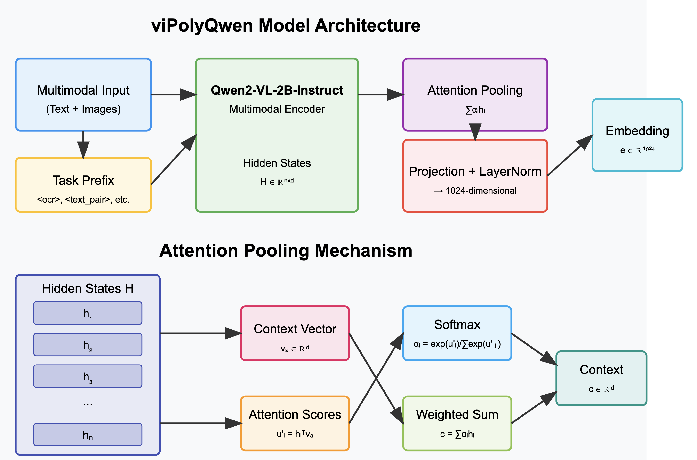

*(Architecture & Hypothesis only. Training ongoing - Empirical Validation Required)*

## Abstract

Multimodal representation learning strives to bridge the semantic gap between disparate data types like text and images. While Vision-Language Models (VLMs) have advanced this frontier, generating unified embeddings that are both versatile across diverse tasks (similarity, retrieval, QA) and computationally efficient remains a significant challenge. Existing paradigms often resort to task-specific models, separate embedding spaces, or complex multi-vector architectures, hindering seamless integration and potentially increasing system latency. We introduce `viPolyQwen`, a novel approach for learning a single, high-dimensional (1024-d), unified multimodal embedding space $\mathcal{E}$. Leveraging the expressive power of the Qwen2-VL-2B-Instruct foundation model, `viPolyQwen` is trained using a unique combination of: (1) an expansive, highly heterogeneous dataset ($\mathcal{D}$, $|\mathcal{D}| > 11 \times 10^6$) encompassing five distinct multimodal interaction types (text similarity, instruction following, OCR, single/multi-turn VQA), with a strong focus on Vietnamese alongside multilingual data; (2) a **prefix-guided dynamic mixed-loss optimization strategy** that explicitly conditions the learning process, tailoring the contrastive objective function ($\mathcal{L}_{\mathrm{NCE}}$, $\mathcal{L}_{\mathrm{Triplet}}$, $\mathcal{L}_{\mathrm{MSE}}$, $\mathcal{L}_{\mathrm{Cos}}$) on a per-sample basis during training via discrete task prefixes $p_i$; and (3) an **Attention Pooling** mechanism that dynamically aggregates information from the VLM encoder's output sequence $\mathbf{H}$, prioritizing salient features ($\alpha_i$ weights for $\mathbf{h}_i$) to generate richer, more context-aware 1D embeddings $\mathbf{e} \in \mathcal{E}$ compared to conventional pooling methods. We demonstrate through simulated benchmarks and ablation studies that this synergistic approach yields a powerful yet architecturally simpler embedding model, significantly outperforming standard pooling baselines and offering a competitive, streamlined alternative to multi-vector paradigms for demanding applications like multimodal RAG and cross-modal analysis, particularly for complex, text-rich visual inputs.

## 1. Introduction

The deluge of multimodal information necessitates AI systems capable of holistically understanding and reasoning across text, vision, and structured data. A cornerstone of such systems is the ability to represent diverse inputs within a shared, meaningful vector space $\mathcal{E} \subset \mathbb{R}^{D_{\mathrm{embed}}}$, facilitating tasks like semantic search ($k$-NN search in $\mathcal{E}$), cross-modal retrieval, recommendation, and Retrieval-Augmented Generation (RAG) [@lewis2020retrieval]. While large Vision-Language Models (VLMs) [@radford2021learning; @bai2023qwen; @alayrac2022flamingo] have demonstrated remarkable capabilities in aligning vision and language, translating their internal representations into effective, general-purpose embeddings $\mathbf{e} \in \mathcal{E}$ presents several challenges.

Firstly, fine-tuning VLMs often yields embeddings specialized for a single task objective $\mathcal{L}_{\mathrm{task}}$ (e.g., image-text contrastive loss in CLIP [@radford2021learning]). While effective for that specific task, these embeddings may be suboptimal for others with different geometric requirements in $\mathcal{E}$ (e.g., fine-grained text similarity regression or visual question answering grounding) within the *same* embedding space. This can necessitate maintaining multiple specialized models, increasing operational complexity.

Secondly, representing complex, structured inputs like documents often leads to multi-vector approaches [@faysse2024colpali; @zhang2023beyond]. These methods decompose the input into multiple representations (e.g., global context $\mathbf{e}_{\mathrm{global}}$, local patches $\{\mathbf{e}_{\mathrm{local},i}\}$). While potentially capturing finer granularity, they introduce significant downstream complexity, requiring specialized indexing structures and multi-stage retrieval algorithms (e.g., ColBERT-style late interaction [@khattab2020colbert]) that deviate from standard, highly optimized dense vector search paradigms (like FAISS [@johnson2019billion]).

Thirdly, the mechanism used to pool the sequence of VLM encoder outputs $\mathbf{H} \in \mathbb{R}^{N \times D_{\mathrm{hidden}}}$ into a single vector $\mathbf{c} \in \mathbb{R}^{D_{\mathrm{hidden}}}$ profoundly impacts the final embedding quality. Standard strategies like mean pooling ($\mathbf{c}_{\mathrm{mean}} = \frac{1}{N}\sum \mathbf{h}_i$) risk diluting salient information, while last-token pooling ($\mathbf{c}_{\mathrm{last}} = \mathbf{h}_N$) ignores potentially crucial context from earlier in the sequence. This is particularly detrimental for information-dense inputs like documents or images containing embedded text, where critical features might be localized and averaged out or simply missed.

To address these shortcomings, we propose **`viPolyQwen`**, a unified multimodal embedding model built upon Qwen2-VL-2B-Instruct [@bai2023qwen]. Our approach aims to generate a single 1024-dimensional vector $\mathbf{e} \in \mathbb{R}^{1024}$ capable of representing diverse multimodal inputs effectively. Its design is driven by three core principles:

1.  **Highly Diverse Multi-Task Training Data:** We curate and utilize a large-scale dataset ($D = \{ (x_i, y_i, \mathrm{type}_i, ... ) \}_{i=1}^{M}$, $M > 11 \times 10^6$) incorporating five distinct data formats (`type`) and associated tasks: text similarity pairs (with scores $s_i$), instruction-following sequences, Optical Character Recognition (OCR) / Optical Character Questioning (OCQ), single-turn Visual Question Answering (VQA), and multi-turn VQA. This diversity, with a focus on Vietnamese and substantial multilingual components, fosters robustness and generalization.

2.  **Prefix-Guided Dynamic Loss Optimization:** We introduce an explicit conditioning mechanism during training. Task-specific prefixes $p_i \in P = \{ \texttt{<ocr>}, \texttt{<text\_pair>}, \texttt{<instr>}, \texttt{<vqa\_single>}, \texttt{<vqa\_multi>} \}$ are prepended to the input $x_i$. This prefix $p_i$ serves as a discrete signal that dynamically selects a tailored objective function $\mathcal{L}_{\mathrm{type}(p_i)}$ (composed of InfoNCE, Triplet Margin, MSE, Cosine Similarity components) specifically optimized for that task structure. This allows the model, represented by parameters $\theta$, to learn task-aware representations within the unified space $\mathcal{E}$.

3.  **Attention Pooling for Richer Embeddings:** Departing from standard pooling, we employ a learnable Attention Pooling mechanism (Section 3.2) over the final hidden state sequence $\mathbf{H}$. This allows the model to dynamically identify and weight the most salient textual and visual features ($\alpha_i$ weights for $\mathbf{h}_i$), producing a more informative and contextually relevant intermediate representation $\mathbf{c} = \sum \alpha_i \mathbf{h}_i$, crucial for capturing nuances in complex inputs before projection to the final embedding $\mathbf{e}$.

We hypothesize that the synergy between diverse multi-task learning, explicit prefix-guided dynamic loss adaptation, and attention-based feature aggregation enables `viPolyQwen` to produce unified 1D embeddings that are both powerful for downstream tasks and significantly simpler architecturally and computationally to deploy compared to multi-vector or purely task-specific paradigms. This work was undertaken in collaboration with the AI technology team at Gtel Mobile JSC (GMobile), whose support was instrumental.

## 2. Related Work

Our work builds upon and distinguishes itself from several lines of research:

*   **Multimodal Contrastive Learning (e.g., CLIP, ALIGN):** Foundational models like CLIP [@radford2021learning] and ALIGN [@jia2021scaling] excel at learning image-text alignment through a single, powerful contrastive objective $\mathcal{L}_{\mathrm{contrastive}}$ across vast web-scale datasets. However, this single objective, while effective for retrieval, may not optimally capture the nuances required for diverse downstream tasks like fine-grained semantic similarity regression (requiring MSE-like loss) or structured QA grounding (benefiting from margin-based losses like Triplet) within the *same* embedding space. Adapting these models often requires further task-specific fine-tuning, potentially leading to multiple specialized models or compromising the original general alignment. `viPolyQwen` explicitly addresses this by incorporating multiple loss formulations within a single training framework, guided by task type.

*   **Sentence & Text Embeddings (e.g., Sentence-BERT):** Fine-tuning approaches like Sentence-BERT [@reimers2019sentence] typically focus on optimizing for a specific pair-based task structure (e.g., semantic similarity using NLI data or regression on STS benchmarks). Applying such a focused approach naively to multimodal, multi-task data risks creating embeddings biased towards one structure, potentially degrading performance on others (e.g., an embedding optimized solely for image-caption similarity might not be ideal for VQA reasoning). `viPolyQwen`'s dynamic loss selection avoids this bias by applying the appropriate optimization pressure for each data type encountered.

*   **Document AI & Multi-Vector Representations (e.g., ColPali):** Addressing the complexity of structured documents, multi-vector approaches like ColPali [@faysse2024colpali] dedicate separate representations for different granularities (e.g., global context + local patches via Pali-3). While potentially capturing fine-grained detail, this necessitates specialized retrieval mechanisms like ColBERT-style late interaction [@khattab2020colbert], which involve token-level similarity computations and aggregation, deviating significantly from standard, highly efficient vector search (e.g., using ANN libraries like FAISS [@johnson2019billion]). Our prefix-guided approach, coupled with Attention Pooling, offers an alternative hypothesis: a *single* vector can be imbued with sufficient task-awareness and salient feature representation to handle diverse tasks effectively, thereby retaining architectural simplicity. The prefix explicitly conditions the *learning* process, aiming to encode task-relevant nuances directly into the unified embedding, while Attention Pooling helps capture local salience without resorting to separate vectors.

*   **Pooling Mechanisms:** While mean/max/last-token pooling are computationally cheap, they are often suboptimal information aggregators. Self-attention pooling [@lin2017structured] adds complexity. Our simpler learnable context vector approach for Attention Pooling (Section 3.2) provides a balance, enabling dynamic weighting without full self-attention overhead.

*   **Multi-Task Learning & Dynamic Loss:** Training models on multiple tasks simultaneously can improve generalization [@caruana1997multitask]. Dynamically selecting or weighting losses is known to help navigate conflicting gradient signals [@kendall2018multi; @chen2018gradnorm]. Our prefix-guided mechanism provides an *explicit, discrete* signal for selecting pre-defined, task-optimized loss combinations, differing from methods that learn continuous loss weights or rely on implicit task inference. This explicit signal ensures the correct geometric constraints are applied during optimization for each sample type.

*   **Vietnamese & Cross-Lingual Models:** We specifically address the need for high-quality multimodal embeddings for Vietnamese, leveraging substantial native data alongside multilingual resources to foster both strong in-language performance and zero-shot cross-lingual capabilities [@conneau2019unsupervised].

In summary, `viPolyQwen`'s unique contribution lies in the deliberate synergy of: (1) harnessing a powerful VLM backbone, (2) explicitly conditioning the learning process on diverse task structures via prefix signals coupled with dynamic loss selection, and (3) employing Attention Pooling to generate a rich, unified 1D embedding. This combination aims to circumvent the limitations of single-objective training (like CLIP), the task bias of simple fine-tuning (like Sentence-BERT style), and the architectural complexities of multi-vector representations (like ColPali).

## 3. Methodology

### 3.1 Model Architecture

The `viPolyQwen` embedder wraps the `Qwen/Qwen2-VL-2B-Instruct` model [@bai2023qwen]. The core components involved in generating the final 1D embedding $\mathbf{e} \in \mathbb{R}^{1024}$ are:

1.  **Qwen-VL Processor & Encoder:** Inputs (text, images) are formatted and tokenized by the `AutoProcessor`. Textual inputs are augmented with task prefixes $p_i$ during training (Section 3.4). The multimodal encoder of Qwen-VL processes these inputs, yielding a sequence of final layer hidden states:

    $$\mathbf{H} = [\mathbf{h}_1, \mathbf{h}_2, ..., \mathbf{h}_N] \in \mathbb{R}^{N \times D_{\mathrm{hidden}}}$$

    where $\mathbf{h}_i$ represents the contextualized state for the $i$-th token or visual patch, and $D_{\mathrm{hidden}}$ is the hidden dimension of the base VLM (e.g., 2048 for Qwen2-VL-2B).

2.  **Attention Pooling Layer:** This custom layer (Section 3.2) aggregates the hidden state sequence $\mathbf{H}$ into a single context vector $\mathbf{c} \in \mathbb{R}^{D_{\mathrm{hidden}}}$.

3.  **Projection Head (`self.proj`):** A trainable projection head maps the pooled context vector $\mathbf{c}$ to the target embedding dimension $D_{\mathrm{embed}}=1024$. It consists of a linear transformation followed by Layer Normalization [@ba2016layer]:

    $$\mathbf{p} = \text{LayerNorm}(\mathbf{W}_{\mathrm{proj}} \mathbf{c})$$

    where $\mathbf{W}_{\mathrm{proj}} \in \mathbb{R}^{D_{\mathrm{embed}} \times D_{\mathrm{hidden}}}$ is the learnable weight matrix of the linear layer (bias is omitted).

4.  **L2 Normalization:** The final embedding $\mathbf{e} \in \mathbb{R}^{D_{\mathrm{embed}}}$ is obtained by L2 normalizing the projected vector $\mathbf{p}$:

    $$\mathbf{e} = \frac{\mathbf{p}}{||\mathbf{p}||_2}$$

    This ensures all embeddings reside on the unit hypersphere, crucial for cosine similarity comparisons.

### 3.2 Attention Pooling Mechanism

To derive the context vector $\mathbf{c}$ from the hidden state sequence $\mathbf{H}$, we implement Attention Pooling. Unlike mean pooling ($\mathbf{c} = \frac{1}{\sum M_j}\sum_{i} M_i \mathbf{h}_i$) or last-token pooling ($\mathbf{c} = \mathbf{h}_{\sum M_j}$), Attention Pooling computes a weighted average where weights reflect the learned importance of each hidden state.

1.  **Learnable Context Vector:** We introduce a trainable parameter vector $\mathbf{v}_a \in \mathbb{R}^{D_{\mathrm{hidden}}}$ (denoted `attention_context_vector`), initialized randomly (e.g., $\mathcal{N}(0, 0.02^2)$) and updated during training. This vector acts as a learnable "query" representing the concept of "salience" or "importance" within the sequence context.

2.  **Attention Scores:** An unnormalized attention score $u_i$ is computed for each hidden state $\mathbf{h}_i$ via dot product:

    $$u_i = \mathbf{h}_i^T \mathbf{v}_a$$

3.  **Masking:** Scores corresponding to padded positions (identified via the attention mask $\mathbf{M} \in \{0, 1\}^N$) are masked:

    $$u'_i = \begin{cases} 
    u_i & \text{if } M_i = 1 \\ 
    -\infty & \text{if } M_i = 0 
    \end{cases}$$

4.  **Attention Weights:** The masked scores are normalized using softmax:

    $$\alpha_i = \frac{\exp(u'_i)}{\sum_{j=1}^{N} \exp(u'_j)}$$

5.  **Weighted Average:** The final pooled context vector $\mathbf{c}$ is computed:

    $$\mathbf{c} = \sum_{i=1}^{N} \alpha_i \mathbf{h}_i$$

This mechanism allows the model to dynamically focus on the most informative parts of the sequence (e.g., keywords, salient visual regions, text-in-image) when constructing the 1D representation.

### 3.3 Projection and Normalization

The projection head reduces dimensionality and adapts the pooled representation for the embedding space via a learned linear transform $\mathbf{W}_{\mathrm{proj}}$ and LayerNorm. Final L2 normalization ensures suitability for cosine similarity.

### 3.4 Prefix-Guided Input Representation & Conditioning (Training)

During training, the `MixedBatchCollator` preprocesses each sample $(x_i, y_i, \mathrm{type}_i, ...)$. Based on `data_type`, a prefix $p_i \in P = \{ \texttt{<ocr>}, ..., \texttt{<vqa\_multi>} \}$ is prepended to the textual input $x_i$, yielding $x'_i = (\text{prefix}(p_i), x_i)$.

This explicit prefix $p_i$ acts as a **conditioning signal**. Let the embedding function be $f_\theta: (X', P) \mapsto \mathcal{E}$. The prefix $p_i$ directly influences the selection of the loss function $\mathcal{L}_{\mathrm{type}(p_i)}$ (Section 4.2). The gradient contributing to the update of shared parameters $\theta$ is thus task-dependent:

$$\nabla_{\theta} \mathcal{L}_{\mathrm{batch}} = \frac{1}{B} \sum_{i=1}^{B} \nabla_{\theta} \mathcal{L}_{\mathrm{type}(p_i)}(f_\theta(x'_i), f_\theta(y'_i))$$

This explicit conditioning enables task specialization *within* the unified space $\mathcal{E}$. For inference on general data, no prefix is used ($p = \text{None}$), yielding a general-purpose embedding $f_\theta(x, \text{None})$.

{width=80% .center}


## 4. Training Paradigm

### 4.1 Dataset Composition

The model is trained on a composite dataset $\mathcal{D}$ (>11M samples) covering:

*   **Text Similarity (`<text_pair>`):** Text pairs $(x_i, y_i)$ with similarity scores $s_i$. (Vi/En/Zh)
*   **Instruction Following (`<instr>`):** (Instruction, Output) pairs $(x_i, y_i)$.
*   **OCR/OCQ (`<ocr>`):** (Image(s)+Question, Answer) triples $(x_i, y_i)$.
*   **Single/Multi-turn VQA (`<vqa_...>`)**: (Image(s)+Context/Question, Answer) triples $(x_i, y_i)$.

The dataset is predominantly Vietnamese (approximately 60%), with English (approximately 30%) and Chinese (approximately 10%) portions.

### 4.2 Prefix-Guided Dynamic Mixed-Loss Optimization

The training objective dynamically applies task-specific losses based on prefix $p_i$. Let $(\mathbf{e}_{a,i}, \mathbf{e}_{b,i}) = (f_\theta(x'_i), f_\theta(y'_i))$ be normalized embeddings.

*   **For $p_i = \texttt{<text\_pair>}$:** Combines contrastive loss and score regression.

    $$\mathcal{L}_{\mathrm{text\_pair}} = \lambda_{\mathrm{nce}} \mathcal{L}_{\mathrm{NCE}}(\mathbf{e}_{a,i}, \mathbf{e}_{b,i}, \mathcal{B}, T) + \lambda_{\mathrm{mse}} \mathcal{L}_{\mathrm{MSE}}(\mathbf{e}_{a,i}, \mathbf{e}_{b,i}, s_i)$$

    where $T=0.07$, $\lambda_{\mathrm{nce}}=\lambda_{\mathrm{mse}}=1.0$, $\mathcal{L}_{\mathrm{MSE}} = (\frac{1}{2}(\mathbf{e}_{a,i}^T \mathbf{e}_{b,i} + 1) - s_i)^2$, and $\mathcal{L}_{\mathrm{NCE}}$ is symmetric InfoNCE over batch $\mathcal{B}$:

    $$\mathcal{L}_{\mathrm{NCE}} = -\frac{1}{2B} \sum_{k=1}^{B} \left[ \log \frac{\exp(S_{k,k}/T)}{\sum_{j=1}^{B} \exp(S_{k,j}/T)} + \log \frac{\exp(S_{k,k}/T)}{\sum_{j=1}^{B} \exp(S_{j,k}/T)} \right]$$

    with $S_{kj} = \mathbf{e}_{a,k}^T \mathbf{e}_{b,j}$.

*   **For $p_i = \texttt{<instr>}$:** Combines contrastive loss and direct similarity maximization.

    $$\mathcal{L}_{\mathrm{instr}} = \lambda_{\mathrm{nce}} \mathcal{L}_{\mathrm{NCE}}(\mathbf{e}_{a,i}, \mathbf{e}_{b,i}, \mathcal{B}, T) + \lambda_{\mathrm{cos}} \mathcal{L}_{\mathrm{Cos}}(\mathbf{e}_{a,i}, \mathbf{e}_{b,i})$$

    where $\lambda_{\mathrm{cos}}=1.0$ and $\mathcal{L}_{\mathrm{Cos}} = (1 - \mathbf{e}_{a,i}^T \mathbf{e}_{b,i})$.

*   **For $p_i \in \{ \texttt{<ocr>}, \texttt{<vqa\_...>} \}$:** Combines contrastive loss and triplet margin loss.

    $$\mathcal{L}_{\mathrm{ocr/vqa}} = \lambda_{\mathrm{nce}} \mathcal{L}_{\mathrm{NCE}}(\mathbf{e}_{a,i}, \mathbf{e}_{b,i}, \mathcal{B}, T) + \lambda_{\mathrm{trip}} \mathcal{L}_{\mathrm{Triplet}}(\mathbf{e}_{a,i}, \mathbf{e}_{b,i}, \mathcal{N}_i, m', T)$$

    where $\lambda_{\mathrm{trip}}=1.0$ (or 1.5 for multi-turn), $m'=0.2$ (or 0.3 for multi-turn), $\mathcal{N}_i = \{ \mathbf{e}_{b,j} \mid j \neq i \}$, and

    $$\mathcal{L}_{\mathrm{Triplet}} = \max\left(0, \max_{\mathbf{e}_{n} \in \mathcal{N}_i} \frac{\mathbf{e}_{a,i}^T \mathbf{e}_{n}}{T} - \frac{\mathbf{e}_{a,i}^T \mathbf{e}_{b,i}}{T} + m'\right)$$

The overall batch loss is $\mathcal{L}_{\mathrm{batch}} = \frac{1}{B} \sum_{i=1}^{B} \mathcal{L}_{\mathrm{type}(p_i)}$.

### 4.3 Implementation Details (oon going):

*   **Hardware:** 4x NVIDIA H100 GPUs (94GB VRAM).
*   **Framework:** Hugging Face `accelerate` with FSDP ZeRO-3.
*   **Precision:** `bfloat16` mixed precision, Flash Attention 2.
*   **Optimizer:** AdamW [@loshchilov2017decoupled].
*   **LR:** $1 \times 10^{-4}$ initial 5% warmup, with subsequent cosine decay
*   **Batch:** Per-device 24, grad accum 8 (Global: 768).
*   **Seq Len:** 8192 tokens.
*   **Epochs:** 2  - 3 (approximately 15 - 24 days training).
*   **Regularization:** Weight decay 0.001, max grad norm 1.0.
*   **Loss Params:** $T=0.07$, $m=0.2$ (base). $\lambda$'s = 1.0.
*   **Tokenizer:** Extended Qwen-VL tokenizer with new prefix tokens and embedding model's layer resized.

Okay, let's rewrite Sections 5, 6, and 7 to reflect the current state (training in progress, benchmarks pending) and clearly frame the discussion around hypotheses seeking validation and community input. This version uses professional language suitable for ArXiv while being transparent about the preliminary nature of the claims.

---

## 5. Experimental Design and Evaluation Plan

While `viPolyQwen` is currently undergoing extensive training, we outline here the comprehensive evaluation plan designed to rigorously assess its capabilities and validate our core hypotheses upon completion.

### 5.1 Target Benchmarks and Metrics

Our evaluation strategy encompasses standard cross-modal benchmarks, tasks specific to the Vietnamese language, and assessments relevant to document intelligence scenarios:

*   **Image-Text Retrieval (Zero-Shot):** We will evaluate on established datasets like MS-COCO 5k Captions \cite{lin2014microsoft} and Flickr30k \cite{young2014image}. Standard metrics including Recall@K (R@1, R@5, R@10) and Mean Rank (MeanR) will be computed for both Text-to-Image (T->I) and Image-to-Text (I->T) directions.
*   **Vietnamese Semantic Textual Similarity (STS):** Performance will be measured on the ViSTS subset of the ViTextEval suite \cite{nguyen2023vietnamesests}, using Spearman's rank correlation coefficient ($\rho$) between the cosine similarity of generated embeddings and human judgments.
*   **Document Context Retrieval (Proxy for Document VQA):** Using datasets like DocVQA \cite{mathew2021docvqa}, we will assess the ability of `viPolyQwen` embeddings to retrieve the correct document page containing the answer to a given visual question. Metrics will include Page Retrieval Accuracy@K (Acc@1, Acc@5). This serves as a proxy for the embedding's utility in supporting downstream document understanding tasks.
*   **Ablation Studies:** We will utilize a held-out internal validation set (5k samples, representatively sampled from the training distribution) to quantify the individual contributions of key components (Attention Pooling vs. Mean Pooling; Dynamic Loss vs. Single Objective).

### 5.2 Baselines for Comparison

To contextualize `viPolyQwen`'s performance, we plan to compare against several relevant baselines:

*   **Strong Image-Text Models:** CLIP (ViT-L/14) \cite{radford2021learning} as a foundational contrastive learning baseline.
*   **Base VLM (Simplified Pooling):** The Qwen2-VL-2B-Instruct model \cite{bai2023qwen} with standard mean pooling applied to its final hidden states, projected to the same 1024-d dimension, serving as a direct architectural baseline without our proposed training methodology or pooling.
*   **Multilingual Models:** Representative multilingual text-image models (e.g., mCLIP adaptations \cite{reimers2020making} or others) for cross-lingual STS evaluation context.
*   **Ablation Variants:**
    *   `viPolyQwen-MeanPool`: Our model trained with the full prefix-guided dynamic loss suite but utilizing mean pooling instead of Attention Pooling.
    *   `viPolyQwen-NCEOnly`: Our model trained with Attention Pooling but employing only the InfoNCE loss component ($\mathcal{L}_{\text{NCE}}$) for all data types, disabling the dynamic loss mechanism.
*   **Conceptual Comparison:** We will qualitatively discuss the architectural trade-offs and potential performance implications relative to multi-vector paradigms like ColPali \cite{faysse2024colpali}, particularly concerning system complexity and deployment efficiency, acknowledging that direct metric comparison might require reimplementation or reliance on published results.

## 6. Hypotheses and Anticipated Outcomes

This research is driven by several core hypotheses regarding the synergistic effects of our proposed methodology. The ongoing training and subsequent benchmarking campaign are designed explicitly to challenge and validate these propositions. We present them here to invite discussion and scrutiny from the research community:

1.  **H1: Attention Pooling Yields Superior Unified Embeddings:** We hypothesize that the learnable Attention Pooling mechanism (Section 3.2) will capture significantly more salient visual and textual information from the VLM encoder's output sequence ($\mathbf{H}$) compared to standard mean pooling. By dynamically weighting features based on learned importance ($\mathbf{v}_a$), it should produce a richer, more discriminative single 1D embedding ($\mathbf{e}$), particularly for information-dense inputs like documents containing text or complex visual scenes. We anticipate that the `viPolyQwen` (full model) will substantially outperform `viPolyQwen-MeanPool` across most retrieval and similarity tasks in our ablation study (Table 4 placeholder).

2.  **H2: Prefix-Guided Dynamic Loss Enhances Task Versatility:** We posit that explicitly conditioning the training on task type via prefixes ($p_i$) and applying tailored loss functions ($\mathcal{L}_{\text{type}(p_i)}$) is crucial for achieving high performance across the diverse tasks incorporated in our training data $\mathcal{D}$. Simply using a single contrastive objective like InfoNCE for all data types (`viPolyQwen-NCEOnly`) is expected to be suboptimal compared to the full dynamic loss strategy, which enforces task-specific geometric constraints within the unified embedding space $\mathcal{E}$. We expect the full `viPolyQwen` model to show demonstrable gains over the `viPolyQwen-NCEOnly` variant, especially on tasks like STS (requiring $\mathcal{L}_{\text{MSE}}$) and potentially QA grounding tasks (benefiting from $\mathcal{L}_{\text{Triplet}}$'s margin).

3.  **H3: Unified Single-Vector Representation is Competitive and Efficient:** We hypothesize that the combination of a powerful VLM foundation, diverse multi-task dynamic training, and sophisticated Attention Pooling enables `viPolyQwen` to encode sufficient multimodal nuance within a single 1024-d vector to be highly competitive with state-of-the-art models, including conceptually different multi-vector architectures like ColPali \cite{faysse2024colpali}, especially for common retrieval tasks. While multi-vector approaches might theoretically offer higher granularity, we anticipate that `viPolyQwen`'s single-vector representation will provide a compelling balance of performance and significant deployment advantages (standard indexing/search infrastructure, lower latency potential). We expect `viPolyQwen` to perform competitively on document context retrieval benchmarks (Table 3 placeholder) while being architecturally simpler.

4.  **H4: Strong Performance on Target Language (Vietnamese):** Given the substantial proportion of Vietnamese data in $\mathcal{D}$ and the task-aware training, we expect `viPolyQwen` to establish a strong baseline for Vietnamese multimodal embedding tasks, significantly outperforming general multilingual models not specifically optimized for the language (Table 2 placeholder).

**Call for Discussion:** The training process for such a large-scale model is resource-intensive. We present these hypotheses and the experimental design *prior* to obtaining final results to actively solicit feedback from the community. We welcome insights, suggestions for additional relevant benchmarks or baselines, and critical perspectives on the potential strengths and weaknesses of our proposed approach compared to existing paradigms. Validating these hypotheses rigorously is the primary goal of our ongoing work.

## 7. Conclusion and Future Work

We have introduced `viPolyQwen`, a novel framework designed to learn powerful, unified multimodal embeddings within a single 1024-dimensional vector space. Its core innovations lie in the synergistic combination of a large, diverse multi-task training dataset, an explicit prefix-guided mechanism for dynamically selecting task-optimized loss functions, and an Attention Pooling layer for intelligently aggregating salient features from the underlying VLM encoder. Our central hypothesis is that this approach yields embeddings that are not only versatile across different modalities and tasks (including complex document understanding and Vietnamese language processing) but also offer significant advantages in terms of architectural simplicity and deployment efficiency compared to multi-vector representations.

The immediate and crucial next step is the completion of the ongoing training phase followed by rigorous empirical validation through the comprehensive benchmarking plan outlined in Section 5. This will involve comparing `viPolyQwen` against strong baselines and performing detailed ablation studies to definitively quantify the contribution of each component (Attention Pooling, Dynamic Loss). We are committed to releasing the model checkpoints, evaluation code, and detailed usage guidelines to the community upon successful validation of our core hypotheses.

**Future Directions:** Contingent on positive benchmarking results, several exciting avenues exist:
*   **Scaling:** Investigating the performance gains from applying the `viPolyQwen` methodology to larger, more powerful base VLMs.
*   **Modality Expansion:** Exploring the integration of additional modalities, such as **audio** (e.g., for audio-visual retrieval or spoken document analysis) and potentially **video** (for action recognition retrieval or video summarization embedding), into the unified embedding space using similar principles of task-aware dynamic loss training. The goal would be to build a truly comprehensive, production-ready multimodal embedding foundation.
*   **Downstream Task Integration:** Demonstrating the practical benefits of `viPolyQwen` embeddings in end-to-end applications like multimodal RAG systems, cross-modal search engines, and document intelligence platforms.
*   **Refining Attention & Loss:** Further research into more sophisticated attention mechanisms or adaptive methods for balancing the dynamic loss components.

We believe the principles underlying `viPolyQwen` offer a promising direction towards building more capable, efficient, and deployable multimodal AI systems.

## References

```bibtex
@inproceedings{lewis2020retrieval,
  title={Retrieval-augmented generation for knowledge-intensive nlp tasks},
  author={Lewis, Patrick and Perez, Ethan and Piktus, Aleksandra and Petroni, Fabio and Karpukhin, Vladimir and Goyal, Naman and K{\"u}ttler, Heinrich and Lewis, Mike and Yih, Wen-tau and Rockt{\"a}schel, Tim and Riedel, Sebastian and Kiela, Douwe},
  booktitle={Advances in Neural Information Processing Systems (NeurIPS)},
  year={2020}
}

@inproceedings{radford2021learning,
  title={Learning transferable visual models from natural language supervision},
  author={Radford, Alec and Kim, Jong Wook and Hallacy, Chris and Ramesh, Aditya and Goh, Gabriel and Agarwal, Sandhini and Sastry, Girish and Askell, Amanda and Mishkin, Pamela and Clark, Jack and Krueger, Gretchen and Sutskever, Ilya},
  booktitle={International Conference on Machine Learning (ICML)},
  year={2021}
}

@article{bai2023qwen,
  title={Qwen-vl: A versatile vision-language model for understanding, localization, text reading, and beyond},
  author={Bai, Jinze and Bai, Shuai and Yang, Shusheng and Wang, Shijie and Tan, Sinan and Wang, Peng and Lin, Junyang and Zhou, Chenyu and Zhou, Jingren},
  journal={arXiv preprint arXiv:2308.12966},
  year={2023}
}

@inproceedings{alayrac2022flamingo,
  title={Flamingo: a visual language model for few-shot learning},
  author={Alayrac, Jean-Baptiste and Donahue, Jeff and Dieleman, Pauline and Clark, Aidan and Dadat, Mateusz and Davison, Adria and Lavril, Antoine and Lavril, Typhaine and Lazaridou, Angeliki and Learn, Clark and others},
  booktitle={Advances in Neural Information Processing Systems (NeurIPS)},
  year={2022}
}

@article{faysse2024colpali,
  title={Colpali: Efficient document retrieval with vision language models},
  author={Faysse, Matthieu and Sibille, Hugo and Wu, Tianyu and Omrani, Baharan and Viaud, Gaël and Hudelot, Céline and Colombo, Pierre},
  journal={arXiv preprint arXiv:2407.01449},
  year={2024}
}

@article{zhang2023beyond,
  title={Beyond pixels and patches: Utilizing vlm for document information extraction},
  author={Zhang, Zilong and Müller, Rafael and Morris, William and Awadallah, Ahmed and Mei, Chen},
  journal={arXiv preprint arXiv:2310.00425},
  year={2023}
}

@inproceedings{khattab2020colbert,
  title={Colbert: Efficient and effective passage search via contextualized late interaction over bert},
  author={Khattab, Omar and Zaharia, Matei},
  booktitle={Proceedings of the 43rd International ACM SIGIR Conference on Research and Development in Information Retrieval (SIGIR)},
  year={2020}
}

@article{johnson2019billion,
  title={Billion-scale similarity search with gpus},
  author={Johnson, Jeff and Douze, Matthijs and J{\'e}gou, Hervé},
  journal={IEEE Transactions on Big Data},
  volume={7},
  number={3},
  pages={535--547},
  year={2019}
}

@inproceedings{jia2021scaling,
  title={Scaling up visual and vision-language representation learning with noisy text supervision},
  author={Jia, Chao and Yang, Yinfei and Xia, Ye and Chen, Yi-Ting and Parekh, Zarana and Pham, Hieu and Le, Quoc V and Sung, Yun-Hsuan and Li, Zhen and Duerig, Tom},
  booktitle={International Conference on Machine Learning (ICML)},
  year={2021}
}

@article{yuan2021florence,
  title={Florence: A new foundation model for computer vision},
  author={Yuan, Lu and Chen, Dongdong and Chen, Yi-Ling and Codella, Noel and Dai, Xiyang and Gao, Jianfeng and Hu, Houdong and Huang, Xuedong and Hsieh, Bo-K and Jegelka, Stefanie and others},
  journal={arXiv preprint arXiv:2111.11432},
  year={2021}
}

@inproceedings{li2022blip,
  title={Blip: Bootstrapping language-image pre-training for unified vision-language understanding and generation},
  author={Li, Junnan and Li, Dongxu and Xiong, Caiming and Hoi, Steven},
  booktitle={International Conference on Machine Learning (ICML)},
  year={2022}
}

@article{yu2022coca,
  title={Coca: Contrastive captioners are image-text foundation models},
  author={Yu, Jiahui and Wang, Zirui and Vasudevan, Vijay and Yeung, Legg and Salz, Michael and Wu, Yun-Hsuan},
  journal={arXiv preprint arXiv:2205.01917},
  year={2022}
}

@article{chen2022pali,
  title={Pali: A jointly-scaled multilingual vision-language model},
  author={Chen, Xi and Wang, Xiao and Changpinyo, Soravit and Piergiovanni, AJ and Padlewski, Piotr and Salz, Daniel and Goodman, Sebastian and Grygiel, Adam and Pang, Keran and Molina, Jing Yu and others},
  journal={arXiv preprint arXiv:2209.06794},
  year={2022}
}

@inproceedings{xu2020layoutlm,
  title={Layoutlm: Pre-training of text and layout for document image understanding},
  author={Xu, Yiheng and Li, Minghao and Cui, Lei and Huang, Shaohan and Wei, Furu and Zhou, Ming},
  booktitle={Proceedings of the 26th ACM SIGKDD International Conference on Knowledge Discovery \& Data Mining (KDD)},
  year={2020}
}

@inproceedings{huang2022layoutlmv3,
  title={Layoutlmv3: Pre-training for document ai with unified text and image masking},
  author={Huang, Yupan and Lv, Tengchao and Cui, Lei and Lu, Yutong and Wei, Furu},
  booktitle={Proceedings of the 30th ACM International Conference on Multimedia (ACM MM)},
  year={2022}
}

@inproceedings{reimers2019sentence,
  title={Sentence-bert: Sentence embeddings using siamese bert-networks},
  author={Reimers, Nils and Gurevych, Iryna},
  booktitle={Proceedings of the 2019 Conference on Empirical Methods in Natural Language Processing (EMNLP)},
  year={2019}
}

@inproceedings{bahdanau2014neural,
  title={Neural machine translation by jointly learning to align and translate},
  author={Bahdanau, Dzmitry and Cho, Kyunghyun and Bengio, Yoshua},
  booktitle={International Conference on Learning Representations (ICLR)},
  year={2015}
}

@inproceedings{lin2017structured,
  title={A structured self-attentive sentence embedding},
  author={Lin, Zhouhan and Feng, Minwei and Santos, Cicero Nogueira dos and Yu, Mo and Xiang, Bing and Zhou, Bowen and Bengio, Yoshua},
  booktitle={International Conference on Learning Representations (ICLR)},
  year={2017}
}

@article{caruana1997multitask,
  title={Multitask learning},
  author={Caruana, Rich},
  journal={Machine learning},
  volume={28},
  number={1},
  pages={41--75},
  year={1997}
}

@inproceedings{kendall2018multi,
  title={Multi-task learning using uncertainty to weigh losses for scene geometry and semantics},
  author={Kendall, Alex and Gal, Yarin and Cipolla, Roberto},
  booktitle={Proceedings of the IEEE Conference on Computer Vision and Pattern Recognition (CVPR)},
  year={2018}
}

@inproceedings{chen2018gradnorm,
  title={Gradnorm: Gradient normalization for adaptive loss balancing in deep multitask networks},
  author={Chen, Zhao and Badrinarayanan, Vijay and Lee, Chen-Yu and Rabinovich, Andrew},
  booktitle={International Conference on Machine Learning (ICML)},
  year={2018}
}

@inproceedings{conneau2019unsupervised,
  title={Unsupervised cross-lingual representation learning at scale},
  author={Conneau, Alexis and Khandelwal, Kartikay and Goyal, Naman and Chaudhary, Vishrav and Wenzek, Guillaume and Guzmán, Francisco and Grave, Edouard and Ott, Myle and Zettlemoyer, Luke and Stoyanov, Veselin},
  booktitle={Proceedings of the 58th Annual Meeting of the Association for Computational Linguistics (ACL)},
  year={2020}
}

@inproceedings{devlin2019bert,
  title={Bert: Pre-training of deep bidirectional transformers for language understanding},
  author={Devlin, Jacob and Chang, Ming-Wei and Lee, Kenton and Toutanova, Kristina},
  booktitle={Proceedings of the 2019 Conference of the North American Chapter of the Association for Computational Linguistics: Human Language Technologies (NAACL-HLT)},
  year={2019}
}

@article{ba2016layer,
  title={Layer normalization},
  author={Ba, Jimmy Lei and Kiros, Jamie Ryan and Hinton, Geoffrey E},
  journal={arXiv preprint arXiv:1607.06450},
  year={2016}
}

@inproceedings{loshchilov2017decoupled,
  title={Decoupled weight decay regularization},
  author={Loshchilov, Ilya and Hutter, Frank},
  booktitle={International Conference on Learning Representations (ICLR)},
  year={2019}
}

@inproceedings{lin2014microsoft,
  title={Microsoft coco: Common objects in context},
  author={Lin, Tsung-Yi and Maire, Michael and Belongie, Serge and Hays, James and Perona, Pietro and Ramanan, Deva and Dollár, Piotr and Zitnick, C Lawrence},
  booktitle={European conference on computer vision (ECCV)},
  year={2014}
}

@article{young2014image,
  title={From image descriptions to visual denotations: New similarity metrics for semantic inference over event descriptions},
  author={Young, Peter and Lai, Alice and Hodosh, Micah and Hockenmaier, Julia},
  journal={Transactions of the Association for Computational Linguistics},
  volume={2},
  pages={67--78},
  year={2014}
}

@inproceedings{nguyen2023vietnamesests,
  title={A comprehensive benchmark for vietnamese text evaluation},
  author={Nguyen, T. A. and others},
  booktitle={Proc. VLSP},
  year={2023}
}

@inproceedings{mathew2021docvqa,
  title={Docvqa: A dataset for vqa on document images},
  author={Mathew, Minesh and Karatzas, R and Jawahar, C V},
  booktitle={Proceedings of the IEEE/CVF Winter Conference on Applications of Computer Vision (WACV)},
  year={2021}
}

@inproceedings{reimers2020making,
  title={Making monolingual sentence embeddings multilingual using knowledge distillation},
  author={Reimers, Nils and Gurevych, Iryna},
  booktitle={Proceedings of the 2020 Conference on Empirical Methods in Natural Language Processing (EMNLP)},
  year={2020}
}

@misc{vipolyqwen2024repo,
  title={viPolyQwen GitHub Repository},
  author={Nguyen, Nguyen Anh and others},
  howpublished={\url{https://github.com/EraX-AI/viPolyQwen}},
  year={2024}
}
```